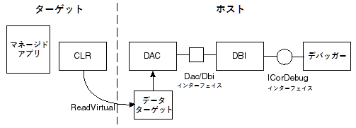

<!--
Data Access Component (DAC) Notes
-->
データアクセスコンポーネント（DAC：Data Access Component）メモ
=================================

（これは https://github.com/dotnet/coreclr/commit/8d3936bff7ae46a5a964b15b5f0bc3eb8d4e32db の日本語訳です。対象rev.は 8d3936bf）

<!--
Date: 2007
-->
2007年版

<!--
Debugging managed code requires special knowledge of managed objects and constructs. For example, objects have various kinds of header information in addition to the data itself. Objects may move in memory as the garbage collector does its work. Getting type information may require help from the loader. Retrieving the correct version of a function that has undergone an edit-and-continue or getting information for a function emitted through reflection requires the debugger to be aware of EnC version numbers and metadata. The debugger must be able to distinguish AppDomains and assemblies. The code in the VM directory embodies the necessary knowledge of these managed constructs. This essentially means that APIs to retrieve information about managed code and data must run some of the same algorithms that the execution engine itself runs.
-->
マネージドコードのデバッグには、マネージドオブジェクトとその機構（constructs）についての特別な知識が必要となります。たとえば、オブジェクトは、データそのものに加えて、さまざまなヘッダー情報を持ちます。オブジェクトはガベージコレクターが動作するとメモリ内で移動する可能性があります。型情報の取得にはタイプローダーの補助が必要かもしれません。エディットアンドコンティニュー（EnC）が完了していない関数の正しいバージョンの取得や、リフレクション経由で出力される関数の情報の取得には、デバッガーがEnCのバージョン番号とメタデータを認識する必要があります。デバッガーは個々のアプリケーションドメインやアセンブリを区別できなければなりません。VMディレクトリ内のコードは、これらのマネージドの機構に必要な知識を具体化しています。これは、本質的には、マネージドコードとデータについての情報を取得するAPIは、実行エンジンそのものが実行するのと類似のアルゴリズムを実行しなければならないことを意味します。

<!--
Debuggers can operate either _in-process_ or _out-of-process_. A debugger that runs in-process requires a live data target (the debuggee). In this case, the runtime has been loaded and the target is running. A helper thread in the debuggee runs code from the execution engine to compute the information the debugger needs. Because the helper thread runs in the target process, it has ready access to the target's address space and the runtime code. All the computation occurs in the target process. This is a simple way to get the information the debugger needs to be able to represent managed constructs in a meaningful way. Nevertheless, an in-process debugger has certain limitations. For example, if the debuggee is not currently running (as is the case when the debuggee is a dump file), the runtime is not loaded (and may not even be available on the machine). In this case, the debugger has no way to execute runtime code to get the information it needs.
-->
デバッガーは_プロセス内（in-process）_か_プロセス外（out-of-process）_のいずれかで動作できます。プロセス内で動作するデバッガーは、実行中のデータターゲット（デバッグ対象）を必要とします。この場合、ランタイムは読み込み済みで、対象は実行中です。デバッガーが必要とする情報を計算するために、デバッグ対象のヘルパースレッドが実行エンジン由来のコードを実行します。ヘルパースレッドは対象のプロセス内で動作するので、対象のアドレス空間とランタイムのコードにアクセスする準備ができています。あらゆる計算は対象のプロセス内で行われます。これは、デバッガーにとって有用な方法で、マネージド機構を表現可能な情報を取得する単純な方法です。それでも、プロセス内デバッガーにはいくつかの限界があります。たとえば、デバッグ対象が現在動作していない場合（デバッグ対象がダンプファイルの場合など）、ランタイムは読み込まれていません（かつ、マシン上で事項可能ですらない可能性があります）。この場合、必要な情報を得るために、デバッガーがランタイムのコードを実行する方法はありません。

<!--
Historically, the CLR debugger has operated in process. A debugger extension, SOS (Son of Strike) or Strike (in the early CLR days) can be used to inspect managed code. Starting with .NET Framework 4, the debugger runs out-of-process. The CLR debugger APIs provide much of the functionality of SOS along with other functionality that SOS does not provide. Both SOS and the CLR debugging APIs use the Data Access Component (DAC) to implement out-of-process debugging. The DAC is conceptually a subset of the runtime's execution engine code that runs out-of-process. This means that it can operate on a dump file, even on a machine that has no runtime installed. Its implementation consists mainly of a set of macros and templates, combined with conditional compilation of the execution engine's code. When the runtime is built, both clr.dll and mscordacwks.dll. For CoreCLR builds, the binaries are slightly different: coreclr.dll and msdaccore.dll. The file names also differ when built for other operating systems, like OS X. To inspect the target, the DAC can read its memory to get the inputs for the VM code in mscordacwks. It can then run the appropriate functions in the host to compute the information needed about a managed construct and finally return the results to the debugger.
-->

これまで、CLRのデバッガーはプロセス内で動作していました。マネージドコードの調査には、デバッガー拡張であるSOS（Son of Strike）またはStrike（初期のCLR用）を使用できます。.NET Framework 4以降、デバッガーはプロセス外で動作します。CLRデバッガーAPIは、SOSの機能の多くを提供するのに加え、SOSが提供しない機能も提供します。SOSとCLRデバッガーAPIは、どちらも、プロセス外デバッグを実装するのにデータアクセスコンポーネント（DAC：Data Access Component）を使用します。概念的には、DACはプロセス外で動作するランタイムの実行エンジンのサブセットです。つまり、ランタイムがインストールされていないマシン上であっても、ダンプファイル上で動作できます。DACの実装は、主に一連のマクロとテンプレートであり、条件付きコンパイルで実行エンジンのコードと組み合わされています。ランタイムがビルドされると、clr.dllとmscordacwks.dllの両方ができます。CoreCLRビルドでは、生成されるバイナリが若干異なっており、coreclr.dllとmsdaccore.dllとなります。ファイル名も、OS Xのような別のオペレーティングシステム向けのビルドでは異なります。デバッグ対象を検査するために、DACは、mscordacwks内のVMコードへの入力を取得するために、デバッグ対象のメモリを読み取ります。それから、マネージド機構について必要な情報を計算するためにホストプロセスで適切な関数を実行し、最終的な結果をデバッガーに返します。

<!--
Notice that the DAC reads _the memory of the target process_. It's important to realize that the debugger and the debuggee are separate processes with separate address spaces. Thus it is important to make a clear distinction between target memory and host memory. Using a target address in code running in the host process would have completely unpredictable and generally incorrect results. When using the DAC to retrieve memory from the target, it is important to be very careful to use addresses from the correct address space. Furthermore, sometimes the target addresses are sometimes strictly used as data. In this case, it would be just as incorrect to use a host address. For example, to display information about a managed function, we might want to list its starting address and size. Here, it is important to provide the target address. When writing code in the VM that the DAC will run, one needs to correctly choose when to use host and target addresses.
-->
DACは_デバッグ対象プロセスのメモリ_を読み取ることに注意してください。デバッガーとデバッグ対象が、別個のアドレス空間を持つ別プロセスであることの認識が重要です。したがって、対象のメモリとホストのメモリを明確に区別することが重要です。ホストプロセス内で実行中のコードでデバッグ対象のアドレスを使用すると、その結果は全く予測できないものとなり、一般的には不正な結果となります。デバッグ対象からメモリを取得するのにDACを使用する場合、正しいアドレス空間由来のアドレスを使用することに最新の注意を払うことが重要です。さらに、デバッグ対象のアドレスは、厳密にはデータとして使用されている場合があります。この場合、ホストのアドレスの使用は単に不正な操作となります。たとえば、マネージド関数についての情報を表示するためには、その開始アドレスとサイズのリストが欲しいところでしょう。この場合、デバッグ対象のアドレスの提供が重要です。DACが動作するVMのコードを記述する場合、その人はホストアドレスとデバッグ対象アドレスのどちらを使用するときなのかを正しく判断する必要があります。

<!--
The DAC infrastructure (the macros and templates that control how host or target memory is accessed) supplies certain conventions that distinguish which pointers are host addresses and which are target addresses. When a function is _DACized_ (i.e., use the DAC infrastructure to make the function work out of process), host pointers of type _T _are declared to be of type _T _\*. Target pointers are of type PTR\ __T_. Remember though, that the concept of host versus target is only meaningful for the DAC. In a non-DAC build, we have only a single address space. The host and the target are the same: the CLR. If we declare a local variable of either type _T \* _or of type PTR\_T in a VM function, it will be a "host pointer" When we are executing code in clr.dll (coreclr.dll), there is absolutely no difference between a local variable of type _T \* _and a local variable of type PTR\__ T._ If we execute the function compiled into mscordacwks.dll (msdaccore.dll) from the same source, the variable declared to be of type _T \*_ will be a true host pointer, with the debugger as the host. If you think about it, this is obvious. Nevertheless it can become confusing when we start passing these pointers to other VM functions. When we are DACizing a function (i.e., changing _T \*_ to PTR\__T_, as appropriate), we sometimes need to trace a pointer back to its point of origin to determine whether it should be a host or target type.
-->
DACのインフラストラクチャ（ホストまたはデバッグ対象のメモリへのアクセス方法を制御するマクロとテンプレート）は、どのポインターがホストアドレスでどのポインターがデバッグ対象アドレス化を区別する、いくつかの規約を提供します。関数が_DAC対応（DACize）_されている（つまり、関数がプロセス外で動作するようにDACインフラストラクチャを使用している）ならば、型_T_のホストポインターは、_T_\*型として宣言されます。デバッグ対象のポインターはPTR\__T_型として宣言されます。とはいうものの、ホスト対デバッグ対象の考え方はDACでのみ意味を持つことを思い出してください。非DACビルドでは、単一のアドレス空間のみ存在します。ホストとデバッグ対象は同じCLRです。VMの関数で_T\*_またはPTR\_T型のローカル変数を宣言すると、それは「ホストポインター」となります。clr.dll（coreclr.dll）でコードを実行する場合、_T\*_型のローカル変数とPTR\__T_型のローカル変数との間には全く違いがありません。同じソースからmscordacwks.dll（msdaccore.dll）にコンパイルされた関数を実行すると、_T\*_型として宣言された変数は真のホストポインターで、ホストとしてのデバッガーと一緒のアドレス空間にいます。考えてみれば当たり前のことです。とはいえ、他のVM関数にこれらのポインターを渡し始めると、混乱し始めることでしょう。関数をDAC対応する場合（つまり、適切に_T\*_をPTR\_T_にする場合）、そのポインターがホストとデバッグ対象どちらの型であるべきかを判断するために、元の場所にトレースバックする必要がある場合があります。

<!--
When one has no understanding of the DAC, it's easy to find the use of the DAC infrastructure annoying. The TADDRs and PTR\_this and dac\_casts, etc. seem to clutter the code and make it harder to understand. With just a little work, though, you'll find that these are not really difficult to learn. Keeping host and target addresses explicitly different is really a form of strong typing. The more diligent we are, the easier it becomes to ensure our code is correct.
-->
DACを理解していない人にとって、DACインフラストラクチャの使用は面倒に感じがちです。TADDRsやPTR\_thisやdac\_castsなどはコードを散らかし、理解を難しくしているように見えます。ただし、少し手を動かしてみるだけで、これらを学ぶことはそれほど難しくないことに気づくでしょう。ホストとデバッグ対象のアドレスを明示的に分けるのは、実は強い型付けの一種です。まじめにやればやるほど、コードを正しくするのが簡単になるのです。

<!--
Because the DAC potentially operates on a dump, the part of the VM sources we build in clr.dll (msdaccore.dll) must be non-invasive. Specifically, we usually don't want to do anything that would cause writing to the target's address space, nor can we execute any code that might cause an immediate garbage collection. (If we can defer the GC, it may be possible to allocate.) Note that the _host_ state is always mutated (temporaries, stack or local heap values); it is only mutating the _target_ space that is problematic. To enforce this, we do two things: code factoring and conditional compilation. In an ideal world, we would factor the VM code so that we would strictly isolate invasive actions in functions that are separate from non-invasive functions.
-->
DACはダンプを操作する可能性があるので、clr.dll（msdaccore.dll）内に構築するVMソースの一部は、非侵入的（non-invasive）でなければなりません。具体的に言うと、一般的にはデバッグ対象のアドレス空間への書き込みを伴う処理をしようとしてはならず、ガベージコレクションの即時実行を引き起こすかもしれないコードを実行することもできません。（GCを遅延させることができるならば、メモリ割り当ても遅延できるでしょう。）_ホスト_の状態（一時変数、スタック、ローカルのヒープの値）は常に変更されることに注意してください。_デバッグ対象_のアドレス空間の変更のみが問題なのです。これを強制するために、2つのこと、つまりはコード編成と条件付きコンパイルを行います。理想的な世界では、非侵入的な関数とは別になるよう、関数の中にある侵入的な操作を厳密に分離するように、VMのコードを編成するでしょう。

<!--
Unfortunately, we have a large code base, most of which we wrote without ever thinking about the DAC at all. We have a significant number of functions with "find or create" semantics and many other functions that have some parts that just do inspection and other parts that write to the target. Sometimes we control this with a flag passed into the function. This is common in loader code, for example. To avoid having to complete the immense job of refactoring all the VM code before we can use the DAC, we have a second method to prevent executing invasive code from out of process. We have a defined pre-processor constant, DACCESS\_COMPILE that we use to control what parts of the code we compile into the DAC. We would like to use the DACCESS\_COMPILE constant as little as we can, so when we DACize a new code path, we prefer to refactor whenever possible. Thus, a function that has "find or create" semantics should become two functions: one that tries to find the information and a wrapper that calls this and creates if the find fails. That way, the DAC code path can call the find function directly and avoid the creation.
-->
残念ながら、我々のコードベースは大きく、ほとんどのコードはDACのことを全く考えることすらせず記述されました。「検索して作成する」というセマンティクスを持つ関数が非常に多くあり、その他の多くの関数は単に検査を行う部分とデバッグ対象に書き込むを行う部分を持つものです。その関数に渡すフラグでこれを制御する場合もあります。たとえば、これはローダーのコードでは一般的です。DACを使用できるようになる前のVMコードをすべてリファクタリングするという膨大な仕事をしなくても済むように、我々はプロセス外での侵入的なコードの実行を防ぐ2番目の方法があります。DACにコンパイルするコードを制御するための、定義済みのプリプロセッサ定数DACCESS\_COMPILEです。我々は、可能な限りDACCESS\_COMPILE定数の使用を最小限にしようとしているので、新しいコードパスをDAC対応する場合には、可能な限りリファクタリングすることを好みます。したがって、「検索して作成する」セマンティクスを持つ関数は2つの関数にすべきです。すなわち、情報を発見しようとする関数と、それを呼び出して検索に失敗した場合に作成を行うラッパー関数です。これにより、DACのコードパスは検索関数を直接呼び出しつつ、作成を避けることができます。

<!--
How does the DAC work?
-->
DACはどのように動作するか
======================

<!--
As discussed, the DAC works by marshaling the data it needs and running code in the mscordacwks.dll (msdaccore.dll) module. It marshals data by reading from the target address space to get a target value, and then storing it in the host address space where the functions in mscordacwks can operate on it. This happens only on demand, so if the mscordacwks functions never need a target value, the DAC will not marshal it.
-->
説明したように、DACはデータを必要な形にマーシャリングし、mscordacwks.dll（msdaccore.dll）モジュールでコードを実行することで動作します。DACはデバッグ対象の値を得るために、デバッグ対象のアドレス空間から読み取りを行うことでデータをマーシャリングし、それをホストのアドレス空間に保存して、mscordacwksの関数が操作できるようにします。これはオンデマンドでのみ行われるので、mscordacwksの関数がデバッグ対象の値を必要としない限り、DACがマーシャリングを行うことはありません。

<!--
Marshaling Principles
-->
マーシャリングの原則
---------------------

<!--
The DAC maintains a cache of data that it reads. This avoids the overhead of reading the same values repeatedly. Of course, if the target is live, the values will potentially change. We can only assume the cached values are valid as long as the debuggee remains stopped. Once we allow the target to continue execution, we must flush the DAC cache. The DAC will retrieve the values again when the debugger stops the target for further inspection. The entries in the DAC cache are of type DAC\_INSTANCE. This contains (among other data) the target address, the size of the data and space for the marshaled data itself. When the DAC marshals data, it returns the address of the marshaled data part of this entry as the host address.
-->
DACは読み取るデータのキャッシュを保持します。これによって、同じ値を繰り返し読み取ることによるオーバーヘッドを避けます。言うまでもなく、デバッグ対象が動作中の場合、値が変更される可能性があります。我々が前提にできるのは、デバッグ対象が停止し続けている限り、キャッシュした値が有効であるということだけです。デバッグ対象に実行の継続を許可したならば、DACのキャッシュをフラッシュしなければなりません。追加の調査のために、デバッガーがデバッグ対象を再び停止したときに、DACはそれらの値を取得することでしょう。DACキャッシュ内のエントリはDAC\_INSTANCE型です。このエントリは、（その他のデータと共に）デバッグ対象のアドレス、データのサイズ、マーシャリングされたデータ自身用の領域を保持します。DACは、データをマーシャリングするとき、このエントリのマーシャリング済みデータのアドレスをホストのアドレスとして返します。

<!--
When the DAC reads a value from the target, it marshals the value as a chunk of bytes of a given size (determined by its type). By keeping the target address as a field in the cache entries, it maintains a mapping between the target address and the host address (the address in the cache). Between any stop and continue of a debugger session, the DAC will marshal each value requested only once, as long as subsequent accesses use the same type. (If we reference the target address by two different types, the size may be different, so the DAC will create a new cache entry for the new type). If the value is already in the cache, the DAC will be able to look it up by its target address. That means we can correctly compare two host pointers for (in)equality as long as we have accessed both pointers using the same type. This identity of pointers does not hold across type conversions however. Furthermore, we have no guarantee that values marshaled separately will maintain the same spatial relationship in the cache that they do in the target, so it is incorrect to compare two host pointers for less-than or greater-than relationships. Object layout must be identical in host and targe, so we can access fields in an object in the cache using the same offsets we use in the target. Remember that any pointer fields in a marshaled object will be target addresses (generally declared as data members of a PTR type). If we need the values at those addresses, the DAC must marshal them to the host before dereferencing them.
-->
DACは、デバッグ対象から値を読み取るとき、（型から判別される）サイズのバイトチャンクとして値をマーシャリングします。キャッシュエントリのフィールドとしてデバッグ対象のアドレスを保持することで、デバッグ対象のアドレスとホストのアドレス（キャッシュ内のアドレス）との間の対応付けを保持します。デバッガーセッションの任意の停止と再開の間、DACは要求されたそれぞれの値について、同じ型を使用してアクセスされ続ける限り、一度だけマーシャリングを行います。（そのデバッグ対象のアドレスを異なる2つの型で参照すると、サイズが異なる可能性があるので、DACは新しい型に対する新しいキャッシュエントリを作成します。）値が既にキャッシュされている場合、DACはそのデバッグ対象のアドレスを抽出できます。つまり、2つのポインターが同じ型を使用している限り、2つのホストポインターの比較によって等値比較を正しく行うことができます。ただし、型変換がある場合、ポインターの同一性は保持されません。さらに、別々にマーシャリングされた値が、デバッグ対象と同じ空間的な関係をDACキャッシュ内で保持することは保証していないので、2つのホストポインターの大小比較は不正な比較です。オブジェクトのレイアウトはホストとデバッグ対象で同一でなければならないので、デバッグ対象で使用しているのと同じオフセットを使用して、DACキャッシュ内のオブジェクトのフィールドにアクセスできます。マーシャリングされたオブジェクト内のあらゆるポインターフィールドはデバッグ対象のアドレス（一般にPTR型のデータメンバーとして宣言されます）になることを思い出してください。それらのアドレスにある値が必要な場合、DACは逆参照する前にそれらをマーシャリングしなければなりません。

<!--
Because we build this dll from the same sources that we use to build mscorwks.dll (coreclr.dll), the mscordacwks.dll (msdaccore.dll) build that the debugger uses must match the mscorwks build exactly. You can see that this is obviously true if you consider that between builds we might add or remove a field from a type we use. The size for the object in mscorwks would then be different from the size in mscordacwks and the DAC could not marshal the object correctly. This has a ramification that's obvious when you think about it, but easy to overlook. We cannot have fields in objects that exist only in DAC builds or only in non-DAC builds. Thus, a declaration such as the following would lead to incorrect behavior.
-->
<!--訳注：原文ではmscorwks.dllだが、他がclr.dllに直されているため、clr.dllとした-->
DACのDLLはclr.dll（coreclr.dll）のビルドと同じソースからビルドするので、デバッガーが使用するmscordacwks.dll（msdaccore.dll）ビルドは、clr.dllビルドと正確に一致しなければなりません。ビルドごとに、使用する型のフィールドの追加または削除が行われるかもしれないと考えると、これが明らかに正しいことがわかるでしょう。clr.dllビルド内のオブジェクトのサイズがmscordacwks.dllビルドと異なってしまい、DACがオブジェクトを正しくマーシャリングできなくなります。これには、考えてみれば明らかなことですが、見落としがちな落とし穴があります。DACビルドでのみ、または非DACビルドでのみ存在するフィールドをオブジェクトに持たせることができないのです。つまり、以下のような宣言は不正な動作の原因となります。

	class Foo
	{
		...
		int nCount;

		// *やってはいけません！* オブジェクトのレイアウトはDACビルドと一致させなければなりません。
		#ifndef DACCESS_COMPILE

			DWORD dwFlags;

		#endif

		PTR_Bar pBar;
		...
	};

<!--
Marshaling Specifics
-->
マーシャリングの仕様
--------------------

<!--
DAC marshaling works through a collection of typedefs, macros and templated types that generally have one meaning in DAC builds and a different meaning in non-DAC builds. You can find these declarations in [src\inc\daccess.h][daccess.h]. You will also find a long comment at the beginning of this file that explains the details necessary to write code that uses the DAC.
-->
DACのマーシャリングは、一般的にDACビルドと非DACビルドで異なる意味を持つ、一連のtypedef、マクロ、テンプレート型によって動作します。これらの宣言は[src\inc\daccess.h][daccess.h]にあります。また、DACを使用するコードを書くのに必要な詳細情報は、このファイルの先頭にある長いコメントの中にあります。

[daccess.h]: https://github.com/dotnet/coreclr/blob/master/src/inc/daccess.h

<!--
An example may be helpful in understanding how marshaling works. The common debugging scenario is represented in the following block diagram:
-->
マーシャリングがどのように動作するのかを理解するうえで、例があると役に立つでしょう。一般的なデバッグのシナリオを次のブロック図で示します。

<!--
The debugger in this figure could be Visual Studio, MDbg, WinDbg, etc. The debugger interfaces with the CLR debugger interface (DBI) APIs to get the information it needs. Information that must come from the target goes through the DAC. The debugger implements the data target, which is responsible for implementing a ReadVirtual function to read memory in the target. The dotted line in the diagram represents the process boundary.
-->
図中のデバッガーは、Visual Studio、MDbg、WinDbgなどがあり得ます。デバッガーは、CLRのデバッガーインターフェイス（DBI）APIと対話して必要な情報を得ます。ターゲットから取らなければならない情報はDACを通って来ます。デバッガーは、ターゲット内でメモリを読み取るためのReadVirtual関数を実装する役割を持つデータターゲットを実装します。図中の破線はプロセス境界を表します。

<!--
Suppose the debugger needs to display the starting address of an ngen'ed method in the managed application that it has gotten from the managed stack. We will assume that the debugger has already gotten an instance of ICorDebugFunction back from the DBI. It will begin by calling the DBI API ICorDebugFunction::GetNativeCode. This calls into the DAC through the DAC/DBI interface function GetNativeCodeInfo, passing in the domain file and metadata token for the function. The following code fragment is a simplification of the actual function, but it illustrates marshaling without introducing extraneous details.
-->
デバッガーが、マネージアプリケーションのNGenされたメソッドの開始アドレス（マネージドスタックから取得されたもの）を表示する必要がある、としましょう。デバッガーは、DBIから返されたICorDebugFunctionのインスタンスを既に取得しているものとします。まずはICorDebugFunction::GetNativeCodeを呼び出します。この呼び出しはDAC/DBIインターフェイス関数であるGetNativeCodeInfo経由でDACを呼び出し、その関数にドメインファイルとメタデータトークンを渡します。下記のコード片は実際の関数を単純化したもので、無関係な詳細を無視してマーシャリングを説明するものです。

	void DacDbiInterfaceImpl::GetNativeCodeInfo(TADDR taddrDomainFile,
	mdToken functionToken,
	NativeCodeFunctionData \* pCodeInfo)
	{
		...

		DomainFile \* pDomainFile = dac\_cast<PTR\_DomainFile>(taddrDomainFile);
		Module \* pModule = pDomainFile->GetCurrentModule();

		MethodDesc\* pMethodDesc = pModule->LookupMethodDef (functionToken);
		pCodeInfo->pNativeCodeMethodDescToken = pMethodDesc;

		// モジュールを読み込み中で、かつ以前に設定したブレークポイントをバインドしようとしている場合、
		// メソッド記述子をまだ得られないかもしれないので、そのケースをチェックします。
		if(pMethodDesc != NULL)
		{
			pCodeInfo->startAddress = pMethodDesc->GetNativeCode();
			...
		}
	}

<!--
The first step is to get the module in which the managed function resides. The taddrDomainFile parameter we pass in represents a target address, but we will need to be able to dereference it here. This means we need the DAC to marshal the value. The dac\_cast operator will construct a new instance of PTR\_DomainFile with a target address equal to the value of domainFileTaddr. When we assign this to pDomainFile, we have an implicit conversion to the host pointer type. This conversion operator is a member of the PTR type and this is where the marshaling occurs. The DAC first searches its cache for the target address. If it doesn't find it, it reads the data from the target for the marshaled DomainFile instance and copies it to the cache. Finally, it returns the host address of the marshaled value.
-->
最初の手順は、マネージド関数が属するモジュールの取得です。渡されたtaddrDomainFileパラメーターはターゲットのアドレスを表しますが、ここでそれを逆参照できなければなりません。つまり、DACに値をマーシャリングさせる必要があります。dac\_cast演算子は、taddrDomainFileの値に等しいターゲットアドレスを持つ、PTR\_DomainFileの新しいインスタンスを作成します。これをpDomainFileに代入すると、ホストポインター型への暗黙の型変換が起こります。この変換演算子はPTR型のメンバーであり、マーシャリングが起こる場所です。DACは、与えられたターゲットアドレスについてDAC内のキャッシュを検索します。見つからなかった場合、マーシャリングされたDomainFileインスタンス用にターゲットからデータを読み取り、キャッシュにコピーします。最後に、マーシャリングされた値のホストアドレスを返します。

<!--
Now we can call GetCurrentModule on this host instance of the DomainFile. This function is a simple accessor that returns DomainFile::m\_pModule. Notice that it returns a Module \*, which will be a host address. The value of m\_pModule is a target address (the DAC will have copied the DomainFile instance as raw bytes). The type for the field is PTR\_Module, however, so when the function returns it, the DAC will automatically marshal it as part of the conversion to Module \*. That means the return value is a host address. Now we have the correct module and a method token, so we have all the information we need to get the MethodDesc.
-->
ここで、DomainFileのホストインスタンスに対して、GetCurrentModuleを呼び出すことができます。この関数は、DomainFile::m\_pModuleを返す単純なアクセッサーです。この関数が返すのが、ホストアドレスであるModule \*であることに注意してください。m\_pModuleの値はターゲットアドレスです（DACはDomainFileのインスタンスを生のバイト列としてコピーします）。ただし、そのフィールドの型はPTR\_Moduleなので、関数がそれを返すと、Module \*への変換の一部として、DACが自動的にマーシャリングを実行します。つまり、戻り値はホストアドレスだということです。ここで、正しいモジュールとメソッドトークンが得られたので、MethodDescを得るのに必要な情報がすべてそろいました。

	Module * DomainFile::GetCurrentModule()
	{
		LEAF_CONTRACT;
		SUPPORTS_DAC;
		return m_pModule;
	}

<!--
In this simplified version of the code, we are assuming that the method token is a method definition. The next step, then, is to call the LookupMethodDef function on the Module instance.
-->
この単純化されたコードでは、メソッドトークンがメソッド定義であると仮定しています。さて、次の手順では、ModuleインスタンスでLookupMethodDef関数を呼び出します。

	inline MethodDesc \*Module::LookupMethodDef(mdMethodDef token)
	{
		WRAPPER\_CONTRACT;
		SUPPORTS\_DAC;
		...
		return dac\_cast<PTR\_MethodDesc>(GetFromRidMap(&m\_MethodDefToDescMap,
		RidFromToken(token)));
	}

<!--
This uses the RidMap to lookup the MethodDesc. If you look at the definition for this function, you will see that it returns a TADDR:
-->
この関数はMethodDescをルックアップするためにRidMapを使います。この関数を定義を調べると、TADDR型を返すことがわかります。

	TADDR GetFromRidMap(LookupMap \*pMap, DWORD rid)
	{
		...

		TADDR result = pMap->pTable[rid];
		...
		return result;
	}

<!--
This represents a target address, but it's not really a pointer; it's simply a number (although it represents an address). The problem is that LookupMethodDef needs to return the address of a MethodDesc that we can dereference. To accomplish this, the function uses a dac\_cast to PTR\_MethodDesc to convert the TADDR to a PTR\_MethodDesc. You can think of this as the target address space form of a cast from void \* to MethodDesc \*. In fact, this code would be slightly cleander if GetFromRidMap returned a PTR\_VOID (with pointer semantics) instead of a TADDR (with integer semantics). Again, the type conversion implicit in the return statement ensures that the DAC marshals the object (if necessary) and returns the host address of the MethodDesc in the DAC cache.
-->
この型はターゲットアドレスを表しますが、実際にはポインターではありません。この値は単なる数値です（アドレスを表すにもかかわらず、です）。問題は、LookupMethodDefは逆参照可能なMethodDescのアドレスを返す必要があるということです。これを可能にするため、LookupMethodDef関数はTADDRをPTR\_MethodDescに変換するために、PTR\_MethodDescへのdac\_castを使います。これは、void \*からMethodDesc \*へのキャストのターゲットアドレス空間用の形式である、と考えることができます。実際のところ、このコードは、GetFromRidMapがTADDR（整数セマンティクス）ではなくPTR\_VOID（ポインターセマンティクス）を返したならば、少しだけわかりやすくなるでしょう。再び、returnステートメントでの暗黙的な型変換により、DACがオブジェクトを（必要に応じて）マーシャリングし、DACキャッシュ内のMethodDescのホストアドレスを返します。

<!--
The assignment statement in GetFromRidMap indexes an array to get a particular value. The pMap parameter is the address of a structure field from the MethodDesc. As such, the DAC will have copied the entire field into the cache when it marshaled the MethodDesc instance. Thus, pMap, which is the address of this struct, is a host pointer. Dereferencing it does not involve the DAC at all. The pTable field, however, is a PTR\_TADDR. What this tells us is that pTable is an array of target addresses, but its type indicates that it is a marshaled type. This means that pTable will be a target address as well. We dereference it with the overloaded indexing operator for the PTR type. This will get the target address of the array and compute the target address of the element we want. The last step of indexing marshals the array element back to a host instance in the DAC cache and returns its value. We assign the the element (a TADDR) to the local variable result and return it.
-->
GetFromRidMap内の代入文は、特定の値を得るために配列のインデックスアクセスを行います。pMapパラメーターはMethodDescにある構造体フィールドのアドレスです。そのような場合、DACはMethodDescのインスタンスのマーシャリング時に、フィールド全体をキャッシュにコピーしています。そのため、この構造体のアドレスであるpMapはホストポインターです。その逆参照はDACを一切介しません。ところが、pTableフィールドはPTR\_TADDRです。ここから、pTableがターゲットアドレスの配列であることがわかりますが、その型はマーシャリングされた型であることを示しています。つまり、pTableはターゲットアドレスでもあるのです。ここでは、PTR型のインデックスアクセス演算子のオーバーロードで逆参照を行います。これにより配列のターゲットアドレスを取得し、対象の要素のターゲットアドレスを計算します。インデックスアクセスの最後の手順は、配列の要素をDACキャッシュ内のホストインスタンスにマーシャリングし、その値を返すことです。その要素（TADDR型）をresultローカル変数に代入し、呼び出し元に返します。

<!--
Finally, to get the code address, the DAC/DBI interface function will call MethodDesc::GetNativeCode. This function returns a value of type PCODE. This type is a target address, but one that we cannot dereference (it is just an alias of TADDR) and one that we use specifically to specify a code address. We store this value on the ICorDebugFunction instance and return it to the debugger.
-->
最後に、コードのアドレスを取得するために、DAC/DBIインターフェイス関数はMethodDesc::GetNativeCodeを呼び出します。この関数はPCODE型の値を返します。この型はターゲットアドレスですが、逆参照できないもの（TADDRの単なるエイリアス）であり、かつコードアドレスを示すための特別な型です。この値をICorDebugFunctionインスタンスに格納し、デバッガーに返します。

<!--
### PTR Types
-->
### PTR型

Because the DAC marshals values from the target address space to the host address space, understanding how the DAC handles target pointers is fundamental. We collectively refer to the fundamental types used for marshaling these as "PTR types." You will see that [daccess.h][daccess.h] defines two classes: \_\_TPtrBase, which has several derived types, and \_\_GlobalPtr. We don't use these types directly; we use them only indirectly through a number of macros. Each of these contains a single data member to give us the target address of the value. For \_\_TPtrBase, this is a full address. For \_\_GlobalPtr, it is a relative address, referenced from a DAC global base location. The "T" in \_\_TPtrBase stands for "target". As you can guess, we use types derived from \_\_TPtrBase for pointers that are data members or locals and we use \_\_GlobalPtr for globals and statics.

In practice, we use these types only through macros. The introductory comment in [daccess.h][daccess.h] has examples of the use of all of these. What is interesting about these macros is that they will expand to declare instantiated types from these marshaling templates in DAC builds, but are no-ops in non-DAC builds. For example, the following definition declares PTR\_MethodTable as a type to represent method table pointers (note that the convention is to name these types with a prefix of PTR\_):

	typedef DPTR(class MethodTable) PTR\_MethodTable;

In a DAC build, the DPTR macro will expand to declare a \_\_DPtr<MethodTable> type named PTR\_MethodTable. In a non-DAC build, the macro simply declares PTR\_MethodTable to be MethodTable \*. This implies that the DAC functionality does not result in any behavior change or performance degradation in non-DAC builds.

Even better, in a DAC build, the DAC will automatically marshal variables, data members, or return values declared to be of type PTR\_MethodTable, as we saw in the example in the last section. The marshaling is completely transparent. The \_\_DPtr type has overloaded operator functions to redefine pointer dereferencing and array indexing, and a conversion operator to cast to the host pointer type. These operations determine whether the requested value is already in the cache, from whence the operators will return them immediately, or whether it is necessary to read from the target and load the value into the cache before returning it. If you are interested in understanding the details, the function responsible for these cache operations is DacInstantiateTypeByAddressHelper.

PTR types defined with DPTR are the most common in the runtime, but we also have PTR types for global and static pointers, restricted-use arrays, pointers to variable-sized objects, and pointers to classes with virtual functions that we may need to call from mscordacwks.dll (msdaccore.dll). Most of these are rare and you can refer to [daccess.h][daccess.h] to learn more about them if you need them.

The GPTR and VPTR macros are common enough to warrant special mention here. Both the way we use these and their external behavior is quite similar to DPTRs. Again, marshaling is automatic and transparent. The VPTR macro declares a marshaled pointer type for a class with virtual functions. This special macro is necessary because the virtual function table is essentially an implicit extra field. The DAC has to marshal this separately, since the function addresses are all target addresses that the DAC must convert to host addresses. Treating these classes in this way means that the DAC automatically instantiates the correct implementation class, making casts between base and derived types unnecessary. When you declare a VPTR type, you must also list it in vptr\_list.h. \_\_GlobalPtr types provide base functionality to marshal both global variables and static data members through the GPTR, GVAL, SPTR and SVAL macros. The implementation of global variables is almost identical to that of static fields (both use the \_\_GlobalPtr class) and require the addition of an entry in [dacvars.h][dacvars.h]. The comments in daccess.h and dacvars.h provide more details about declaring these types.

[dacvars.h]: https://github.com/dotnet/coreclr/blob/master/src/inc/dacvars.h

Global and static values and pointers are interesting because they form the entry points to the target address space (all other uses of the DAC require you to have a target address already). Many of the globals in the runtime are already DACized. It occasionally becomes necessary to make a previously unDACized (or a newly introduced) global available to the DAC. By using the appropriate macros and [dacvars.h][dacvars.h] entry, you enable a post-build step (DacTableGen.exe run by the build in ndp\clr\src\dacupdatedll) to save the address of the global (from clr.pdb) into a table that is embedded into mscordacwks.dll. The DAC uses this table at run-time to determine where to look in the target address space when the code accesses a global.

<!--
### VAL Types
-->
### VAL型

In addition to pointer types, the DAC must also marshal static and global values (as opposed to values referenced by static or global pointers). For this we have a collection of macros ?VAL\_\*. We use GVAL\_\* for global values, and SVAL\_\* for static values. The comment in the [daccess.h][daccess.h] file has a table showing how to use the various forms of these and includes instructions for declaring global and static values (and global and static pointers) that we will use in DACized code.

<!--
### Pure Addresses
-->
### 純粋なアドレス

The TADDR and PCODE types we introduced in the example of DAC operation are pure target addresses. These are actually integer types, rather than pointers. This prevents code in the host from incorrectly dereferencing them. The DAC does not treat them as pointers either. Specifically, because we have no type or size information no dereferencing or marshalling can occur. We use these primarily in two situations: when we are treating a target address as pure data and when we need to do pointer arithmetic with target addresses (although we can also do pointer arithmetic with PTR types). Of course, because TADDRs have no type information for the target locations they specify, when we perform address arithmetic, we need to factor in the size explicitly.

We also have one special class of PTRs that don't involve marshaling: PTR\_VOID and PTR\_CVOID. These are the target equivalents of void \* and const void \*, respectively. Because TADDRs are simply numbers, they don't have pointer semantics, which means that if we DACize code by converting void \* to TADDR (as was often the case in the past), we often need extra casts and other changes, even in code that does not compile for the DAC. Using PTR\_VOID makes it easier and cleaner to DACize code that uses void \* by preserving the semantics expected for void \*. If we DACize a function that uses PTR\_VOID or PTR\_CVOID, we can't directly marshal data from these addresses, since we have no idea how much data we would need to read. This means we can't dereference them (or even do pointer aritmetic), but this is identical to the semantics of void \*. As is the case for void \*, we generally cast them to a more specific PTR type when we need to use them. We also have a PTR\_BYTE type, which is a standard marshaled target pointer (that supports pointer arithmetic, etc.). In general, when we DACize code, void \* becomes PTR\_VOID and BYTE \* becomes PTR\_BYTE, just as you would expect. [daccess.h][daccess.h] has explanatory comments that provide more details about the use and semantics of the PTR\_VOID type.

Occasionally, legacy code stores a target address in a host pointer type such as void \*. This is always a bug and makes it extremely difficult to reason about the code. It will also break when we support cross-platform, where the pointer types are differenct sizes). In DAC builds, the void \* type is a host pointer which should never contain a target address. Using PTR\_VOID instead allows us to indicate that a void pointer type is a target address. We are trying to eliminate all such uses, but some are quite pervasive in the code and will take a while to eliminate entirely.

<!--
### Conversions
-->
### 変換

In earlier CLR versions, we used C-style type casting, macros, and constructors to cast between types. For example, in MethodIterator::Next, we have the following:

	if (methodCold)
	{
		PTR_CORCOMPILE_METHOD_COLD_HEADER methodColdHeader
		= PTR_CORCOMPILE_METHOD_COLD_HEADER((TADDR)methodCold);

		if (((TADDR)methodCode) == PTR_TO_TADDR(methodColdHeader->hotHeader))
		{
			// Matched the cold code
			m_pCMH = PTR_CORCOMPILE_METHOD_COLD_HEADER((TADDR)methodCold);
			...

Both methodCold and methodCode are declared as BYTE \*, but in fact hold target addresses. In line 4, methodCold is casted to a TADDR and used as the argument to the constructor for PTR\_CORCOMPILE\_METHOD\_COLD\_HEADER. At this point, methodColdHeader is explicitly a target address. In line 6, there is another C-style cast for methodCode. The hotHeader field of methodColdHeader is of type PTR\_CORCOMPILE\_METHOD\_HEADER. The macro PTR\_TO\_TADDR extracts the raw target address from this PTR type and assigns it to methodCode. Finally, in line 9,  another instance of type PTR\_CORCOMPILE\_METHOD\_COLD\_HEADER is constructed. Again, methodCold is casted to TADDR to pass to this constructor.

If this code seems overly complex and confusing to you, that's good. In fact it is. Worse, it provides no protection for the separation of host and target addresses. From the declarations of methodCold and methodCode, there is no particular reason to interpret them as target addresses at all. If these pointers were dereferenced in DAC builds as if they really were host pointers, the process would probably AV. This snippet demonstrates that any arbitrary pointer type (as opposed to a PTR type) can be casted to a TADDR. Given that these two variables always hold target addresses, they should be of type PTR\_BYTE, rather than BYTE \*.

There is also a disciplined means to cast between different PTR types: dac\_cast. The dac\_cast operator is the DAC-aware vesion of the C++ static\_cast operator (which the CLR coding conventions stipulate instead of C-style casts when casting pointer types). The dac\_cast operator will do any of the following things:

1. Create a PTR type from a TADDR
2. Convert one PTR type to another
3. Create a PTR from a host instance previously marshaled to the DAC cache
4. Extract the TADDR from a PTR type
5. Get a TADDR from a host instance previously marshaled to the DAC cache

Now, assuming both methodCold and methodCode are declared to be of type PTR\_BYTE, the code above can be rewritten as follows.

	if (methodCold)
	{
		PTR_CORCOMPILE_METHOD_COLD_HEADER methodColdHeader
		= dac_cast<PTR_CORCOMPILE_METHOD_COLD_HEADER>(methodCold);

		if (methodCode == methodColdHeader->hotHeader)
		{
			// Matched the cold code
			m_pCMH = methodColdHeader;

You might argue that this code still seems complex and confusing, but at least we have significantly reduced the number of casts and constructors. We have also used constructs that maintain the separation between host and target pointers, so we have made the code safer. In particular, dac\_cast will often generate compiler or run-time errors if we try to do the wrong thing. In general, dac\_cast should be used for conversions.

<!--
DACizing
-->
DAC対応
========

<!--
When do you need to DACize?
-->
DAC対応が必要な場合とは
---------------------------

Whenever you add a new feature, you will need to consider its debuggability needs and DACize the code to support your feature. You must also ensure that any other changes, such as bug fixes or code clean-up, conform to the DAC rules when necessary. Otherwise, the changes will break the debugger or SOS. If you are simply modifying existing code (as opposed to implementing a new feature), you will generally be able to determine that you need to worry about the DAC when a function you modify includes a SUPPORTS\_DAC contract. This contract has a few variants such as SUPPORTS\_DAC\_WRAPPER and LEAF\_DAC\_CONTRACT. You can find comments explaining the differences in [contract.h][contract.h]. If you see a number of DAC-specific types in the function, you should assume the code will run in DAC builds.

[contract.h]: https://github.com/dotnet/coreclr/blob/master/src/inc/contract.h

DACizing ensures that code in the engine will work correctly with the DAC. It is important to use the DAC correctly to marshal values from the target to the host. Target addresses used incorrectly from the host (or vice versa) may reference unmapped addresses. If addresses are mapped, the values will be completely unrelated to the values expected. As a result, DACizing mostly involves ensuring that we use PTR types for all values that the DAC needs to marshal. Another major task is to ensure that we do not allow invasive code to execute in DAC builds. In practice, this means that we must sometimes refactor code or add DACCESS\_COMPILE preprocessor directives. We also want to be sure that we add the appropriate SUPPORTS\_DAC contract. The use of this contract signals to developers that the function works with the DAC. This is important for two reasons:

1. If we later call it from some other SUPPORTS\_DAC function, we know that it is DAC-safe and we don't need to worry about DACizing it.
2. If we make modifications to the function, we need to make sure that they are DAC-safe. If we add a call to another function from this one, we also need to ensure that it is DAC-safe or that we only make the call in non-DAC builds.