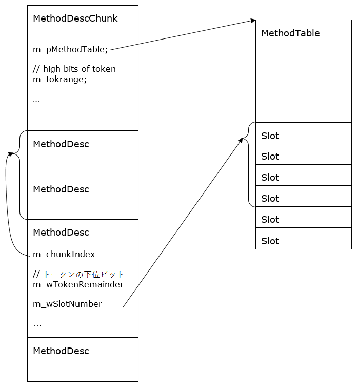
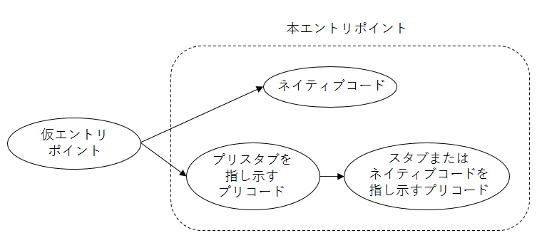
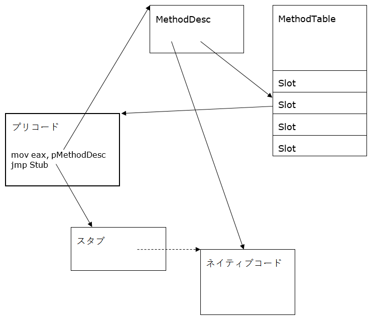

メソッド記述子
=================

（これは https://github.com/dotnet/coreclr/blob/master/Documentation/botr/method-descriptor.md の日本語訳です。対象rev.は 09ad260）

Author: Jan Kotas ([@jkotas](https://github.com/jkotas)) - 2006

はじめに
============

MethodDesc（メソッド記述子、Method Descriptor）はマネージドメソッドの内部表現です。これによっていくつかの目的が達成されます。

- 実行時に使用可能な一意なメソッドハンドルの提供。通常のメソッドでは、MethodDescは&lt;モジュール, メタデータトークン, インスタンシエーション&gt;の組に対する一意なハンドルです。
- 頻繁に使用される情報（たとえば、メソッドが静的かどうか）を、毎回コストがかかるメタデータからの計算をしないようキャッシュする。
- メソッドの実行時の状態（たとえば、そのメソッド用のコードが生成済みかどうか）のキャプチャ。
- そのメソッドのエントリポイントの保持。

設計上の目標と目標でないもの
--------------------------

### 目標

**パフォーマンス：**MethodDescの設計はサイズを重視して最適化しています。すべてのメソッドについて、1つのMethodDescがあるためです。たとえば、現在の設計では、通常の非ジェネリックメソッドに対するMethodDescは8バイトです。

### 目標でないもの

**機能の豊富さ：**MethodDescはメソッドについての全ての情報をキャッシュしません。あまり使用されない情報（たとえば、メソッドシグネチャ）のためには、元になっているメタデータにアクセスしなければならないはずです。

MethodDescの設計
====================

MethodDescの種類
--------------------

MethodDescには複数の種類があります：

**IL**

普通のILメソッドに使用されます。

**Instantiated**

ジェネリックインスタンシエーションを持つ、またはメソッドテーブルに事前アロケートされていない、あまり一般的ではないILメソッドに使用されます。

**FCall**

アンマネージコードで実装された内部メソッド。[MethodImplAttribute(MethodImplOptions.InternalCall)属性で修飾されたメソッド](mscorlib.md)、デリゲートのコンストラクター、そしてtlbimpのコンストラクターです。

**NDirect**

P/Invokeのメソッド。DllImport属性で修飾されたメソッドです。

**EEImpl**

ランタイムによって実装が提供される、デリゲートのメソッド（Invoke、BeginInvoke、EndInvoke）。[ECMA 335 Partition II - Delegates](https://github.com/dotnet/coreclr/blob/master/Documentation/project-docs/dotnet-standards.md)を参照してください。

**Array**

ランタイムによって実装が提供される、配列のメソッド（Get、Set、Address）。[ECMA Partition II – Arrays](https://github.com/dotnet/coreclr/blob/master/Documentation/project-docs/dotnet-standards.md)を参照してください。

**ComInterop**

COMインターフェイスのメソッド。非ジェネリックインターフェイスは既定でCOM相互運用に使用できるので、一般的に、この種類のMethodDescはすべてのインターフェイスメソッドに使用されます。

**Dynamic**

<!-- 訳注：原文ではLKGだがLCGのはず。Stub-as-ILはP/InvokeのILスタブ -->
元になるメタデータなしで動的に作成されるメソッドです。ILスタブとLCG（Light-weight Code Generation）で生成されます。

実装の代替案
---------------------------

仮想メソッドと継承は、C++でさまざまなMethodDescを実装する自然な方法と思われます。仮想メソッドでは各MethodDescにvtableポインタが追加されることになり、貴重なメモリ空間が大量に浪費されるでしょう。vtableポインタはx86で4バイトを占有します。その代わりに、仮想化は3ビットに収まるMethodDesc種別による分岐によって実装されます。例：

	DWORD MethodDesc::GetAttrs()
	{
	    if (IsArray())
	        return ((ArrayMethodDesc\*)this)->GetAttrs();

	    if (IsDynamic())
	        return ((DynamicMethodDesc\*)this)->GetAttrs();

	    return GetMDImport()->GetMethodDefProps(GetMemberDef());
	}

メソッドスロット（method slot）
------------

それぞれのMethodDescはスロットを持ち、スロットにはメソッドのエントリポイントが含まれます。全てのメソッドについて、スロットとエントリポイントが存在しなければなりません。たとえ抽象メソッドのように決して実行されることのないメソッドであってもです。エントリポイントとMethodDescの間に1:1の対応付けがあることに依存している場所がランタイムの複数の場所にあるので、この関係性は不変です。

スロットはMethodTableかMethodDesc自身のいずれかにあります。スロットの場所はMethodDescの`mdcHasNonVtableSlot`によって決定されます。

スロットインデックスによる効率的なルックアップが必要なメソッド（たとえば仮想メソッドやジェネリック型のメソッド）については、スロットはMethodTableに保存されます。この場合にエントリポイントを高速にルックアップできるよう、MethodDescはそのスロットインデックスを含みます。

そうでない場合、スロットはMethodDesc自身の一部です。この配置によってデータの局所性が改善され、ワーキングセットが節約されます。同様に、エディットアンドコンティニュー、ジェネリックメソッドのインスタンシエーション、[動的メソッド](https://github.com/dotnet/coreclr/blob/master/src/mscorlib/src/System/Reflection/Emit/DynamicMethod.cs)のように、動的に作成されるMethodDescについて、MethodTableにあらかじめスロットを割り当てておくことができない場合すらあります。

MethodDescチャンク
-----------------

MethodDescは領域を節約するためにチャンクとして割り当てられます。複数のMethodDescは、同一のMethodTableや同一のメタデータトークンの上位ビットを持つ傾向にあります。MethodDescChunkは、複数のMethodDescの配列の前に、共通の情報を巻き取った形になります。MethodDescは、その配列内での自分自身のインデックスを持ちます。

図1 MethodDeskChunkとMethodTable

デバッグ
---------

MethodDescのデバッグには、以下のSOSコマンドが役立ちます：

- **DumpMD** - MethodDescの内容をダンプします：

		!DumpMD 00912fd8
		Method Name: My.Main()
		Class: 009111ec
		MethodTable: 00912fe8md
		Token: 06000001
		Module: 00912c14
		IsJitted: yes
		CodeAddr: 00ca0070

- **IP2MD** - 指定されたコードアドレスに対するMethodDescを検索します：

		!ip2md 00ca007c
		MethodDesc: 00912fd8
		Method Name: My.Main()
		Class: 009111ec
		MethodTable: 00912fe8md
		Token: 06000001
		Module: 00912c14
		IsJitted: yes
		CodeAddr: 00ca0070

- **Name2EE** - 指定されたメソッド名に対するMethodDescを検索します：

		!name2ee hello.exe My.Main
		Module: 00912c14 (hello.exe)
		Token: 0x06000001
		MethodDesc: 00912fd8
		Name: My.Main()
		JITTED Code Address: 00ca0070

- **Token2EE** - 指定されたトークンに対するMethodDescを検索します（複雑な名前を持つメソッドに対するMethodDescの検索に役立ちます）：

		!token2ee hello.exe 0x06000001
		Module: 00912c14 (hello.exe)
		Token: 0x06000001
		MethodDesc: 00912fd
		8Name: My.Main()
		JITTED Code Address: 00ca0070

- **DumpMT** -MD - 指定されたMethodTableにある全てのMethodDescをダンプします：

		!DumpMT -MD 0x00912fe8
		...
		MethodDesc Table
		   Entry MethodDesc      JIT Name
		79354bec   7913bd48   PreJIT System.Object.ToString()
		793539c0   7913bd50   PreJIT System.Object.Equals(System.Object)
		793539b0   7913bd68   PreJIT System.Object.GetHashCode()
		7934a4c0   7913bd70   PreJIT System.Object.Finalize()
		00ca0070   00912fd8      JIT My.Main()
		0091303c   00912fe0     NONE My..ctor()

デバッグビルドでは、MethodDescにメソッドの名前とシグネチャのフィールドがあります。これはランタイムの状態がひどく壊れていて、SOS拡張が動作しない場合のデバッグに役立ちます。

プリコード（precode）
=======

プリコードは、仮エントリポイントの実装と、スタブに対する効率的なラッパーの実装に使用される小さなコード片です。プリコードはこれら2つのケース用のニッチなコードジェネレーターであり、可能な限り最も効率的なコードを生成します。理想的な世界であれば、ランタイムによって動的に生成される全てのネイティブコードはJITによって生成されることでしょう。ただし、これら2つのシナリオに固有の要件があり、そのようにすることはできません。基本的なx86のプリコードは次のようなものです：

	mov eax,pMethodDesc // MethodDescをスクラッチレジスタに読み込む
	jmp target          // ターゲットにジャンプする

**効率的なスタブラッパー：**特定のメソッド（P/Invoke、デリゲート呼び出し、多次元配列のゲッターとセッターなど）は、一般的には手書きのアセンブリスタブとして、ランタイムによって提供されます。プリコードは複数の呼び出し元に対して同時対応するために、スタブの上に空間効率の良いラッパーを提供します。

スタブのワーカーコードはプリコード片によってラップされます。このプリコード片は、MethodDescに対応付けることができ、さらにこのワーカーコードにジャンプするものです。このようにして、スタブのワーカーコードを複数のメソッドで共有できます。これは、P/Invokeのマーシャリングスタブを実装するために使用される重要な最適化です。さらに、これはMethodDescとエントリポイントの間に1:1の対応付けを作成し、これにより単純かつ効率的な低レベルシステムを達成します。

**仮エントリポイント（temporary entry points）：**メソッドは、自身がJITコンパイルされる前にそのエントリポイントを提供し、JITされるコードが呼び出し先のアドレスを持てるようにしなければなりません。これらの仮エントリポイントはプリコードによって提供されます。これは、特別な形態のスタブラッパーです。

この技術は、JIT処理に対する遅延手法であり、空間的および時間的なパフォーマンス最適化を提供します。そうしないと、メソッドの過渡的なクロージャを、実行前にJITしておく必要が生じるでしょう。対象のコード分岐（たとえばif文）の依存先のみがJITを必要とするることから、過渡的なクロージャは無駄なものになるでしょう。

それぞれの仮エントリポイントは、一般的なメソッドの本体よりもはるかに小さなものです。仮エントリポイントは多数存在するので、パフォーマンスを犠牲にしてでも、小さなコードにする必要があります。仮エントリポイントは、メソッド用の実際のコードが生成される前に一度だけ実行されます。

仮エントリポイントのターゲットはPreStub（事前スタブ）で、これはメソッドのJITコンパイルを起動する特殊なスタブです。これは、仮エントリポイントを本エントリポイント（stable entry point）で不可分操作で置き換えます。本エントリポイントはメソッドの生存期間中に渡って一定です。この不変性はスレッドセーフティを保証するために必要となります。メソッドスロットが常にロックなしで取得されるためです。

**本エントリポイント**はネイティブコードかプリコードのいずれかになります。**ネイティブコード**はJITコンパイル済みコードか、NGenイメージに保存されたコードのいずれかです。実際にはネイティブコードのことを指してJITコンパイル済みコードということがよくあります。

仮エントリポイントはNGenイメージに決して保存されません。NGenイメージにある全てのエントリポイントは、決して変更されない本エントリポイントです。これは、プライベートワーキングセットを削減する重要な最適化です。

図2 エントリポイントの状態図

<!-- 訳注：fixupはNGenで特殊な意味を持っていそうなのでカタカナしにしてある -->
メソッドは、実際のメソッド本体が実行される前に何かを行う必要がある場合、ネイティブコードとプリコードの両方を持つ可能性があります。一般的に、この状況はNGenイメージのフィックスアップ（fixup）中に発生します。この場合、ネイティブコードは省略可能なMethodDescのスロットです。これはコストのかからない統一的な方法でメソッドのネイティブコードをルックアップするのに必要です。

図3 最も複雑なケースでのプリコードとスタブとネイティブコード

単一回呼び出し可能エントリポイントと複数回呼び出し可能エントリポイント
-----------------------------------------------

エントリポイントはメソッドを呼び出すために必要です。MethodDescは、ある状況下で最も効率的にエントリポイントを取得するためのロジックをカプセル化するメソッドを公開します。ここで重要となる状況の違いは、そのエントリポイントが、対象のメソッドをただ一度だけ呼び出すために使用されるのか、またはそのメソッドを複数回呼び出すために使用されるのかです。

たとえば、複数回メソッドを呼び出すのに仮エントリポイントを使用すると、呼び出しのたびに事前スタブを経由することになるため、これはよくない考え方でしょう。それに対して、ただ一度だけのメソッド呼び出しで仮エントリポイントを使うのは問題ありません。

MethodDescにある、呼び出し可能エントリポイント取得メソッドは次のとおりです。

- MethodDesc::GetSingleCallableAddrOfCode
- MethodDesc::GetMultiCallableAddrOfCode
- MethodDesc::GetSingleCallableAddrOfVirtualizedCode
- MethodDesc::GetMultiCallableAddrOfVirtualizedCode

プリコードの種類
----------------

特別な種類のプリコードが複数あります。

プリコードの型は命令列からコストをかけることなく計算可能でなければなりません。x86とx64では、プリコードの種類は定数オフセットにある1バイトをフェッチすることで計算されます。言うまでもありませんが、これはさまざまな種類のプリコードを実装するにあたって、その命令列に制限があるということを意味します。

**StubPrecode**

StubPrecodeは基本的な種類のプリコードです。スクラッチレジスタにMethodDescを読み込み、ジャンプします。プリコードが動作するには、この型が実装されていなければなりません。他の専用プリコード型が使用できない場合、フォールバックとして使用されるからです。

その他全ての型は、プラットフォーム固有ファイルがHAS\_XXX\_PRECODE定義によって有効にする、オプションの最適化です。

x86のStubPrecodeは次のようになります：

	mov eax,pMethodDesc
	mov ebp,ebp // プリコードの種類をマークするダミー命令
	jmp target

「target」は、最初は事前スタブを指し示します。そして、最終的なターゲットを指し示すように上書きされます。最終的なターゲット（スタブまたはネイティブコード）は、eax内のMethodDescを使っても使わなくても構いません。スタブは頻繁にMethodDescを使用し、ネイティブコードはMethodDescを使用しません。

**FixupPrecode**

FixupPrecodeは、最終的なターゲットがスクラッチレジスタ内にMethodDescを必要としない場合に使用されます2。FixupPrecodeはスクラッチレジスタへのMethodDescの読み込みを避けることで、数サイクルを節約します。

FixupPrecodeのもっとも一般的な使用は、NGenイメージにおけるメソッドのフィックスアップです。

FixupPrecodeのx86における初期状態は次のとおりです：

	call PrecodeFixupThunk // この呼び出しは決して戻ってきません。
	                       // PrecodeFixupThunkはリターンアドレスをポップし、
	                       // そのアドレスを使用してこの後ろにあるpMethodDescをフェッチして、
	                       // JITコンパイルされなければならないメソッドが何かを判別します。
	pop esi // プリコードの種類をマークするダミー命令
	dword pMethodDesc

上書きされると、最終的なターゲットを指し示します：

	jmp target
	pop edi
	dword pMethodDesc

2 スクラッチレジスタにMethodDescを渡す行為は、**MethodDesc呼び出し規約**と言われることがあります。

**FixupPrecodeチャンク**

FixupPrecodeチャンクは複数のFixupPrecodeの空間効率の良い表現です。領域を共有するために、複数のFixupPrecodeから類似のMethodDescポインターを巻き取るという点で、MethodDescChunkの考え方を真似ています。

FixupPrecodeは領域を節約し、プリコードのコード密度を改善します。FixupPrecodeチャンクによるコード密度の改善は、x64での大規模サーバーのシナリオで1%から2%になりました。

FixupPrecodeチャンクはx86で次のようになります：

	jmp Target2
	pop edi // プリコードの種類をマークするダミー命令
	db MethodDescChunkIndex
	db 2 (PrecodeChunkIndex)

	jmp Target1
	pop edi
	db MethodDescChunkIndex
	db 1 (PrecodeChunkIndex)

	jmp Target0
	pop edi
	db MethodDescChunkIndex
	db 0 (PrecodeChunkIndex)

	dw pMethodDescBase

1つのFixupPrecodeチャンクは1つのMethodDescChunkに対応します。ただし、FixupPrecodeチャンク内のFixupPrecodeと、MethodDescChunk内のMethodDescの間に1:1の対応付けはありません。それぞれのFixupPrecodeは所属するメソッドのインデックスを持ちます。これによって、必要とするメソッドに対してのみFixupPrecodeチャンクにFixupPrecodeを割り当てられるようにできます。

**コンパクトエントリポイント（compact entry point）**

コンパクトエントリポイントは仮エントリポイントの空間効率の良い実装です。

StubPrecodeまたはFixupPrecodeを使用して実装される仮エントリポイントは、実際のコードを指し示すようにパッチ処理できます。JITコンパイルされるコードは仮エントリポイントを直接呼び出すことができます。この場合、仮エントリポイントは複数回呼び出し可能エントリポイントにできます。

コンパクトエントリポイントは実際のコードを指し示すようにパッチ処理することはできません。JITされるコードはコンパクトエントリポイントを直接呼び出すことはできません。サイズのために、スピードを犠牲にするのです。コンパクトエントリポイントへの呼び出しは、テーブル（FuncPtrStubs）内のスロット経由の間接呼び出しになり、最終的に実際のエントリポイントを指し示すようにテーブルが上書きされます。この場合、複数回呼び出し可能エントリポイントの要求では、StubPrecodeまたはFixupPrecodeがオンデマンドに割り当てられます。

生の速度差は、対象のプラットフォームにおける、コンパクトエントリポイントにおける間接呼び出しのコストと、直接呼出しと直接ジャンプ1回ずつのコストの間の差になります。後者の方が、（2005年時点で）ハードウェアによってより上手く事前予測できるために、大規模サーバーシナリオで数パーセント高速になっていました。これは、現在（2015年）のハードウェアでは常に当てはまるとは限りません。

コンパクトエントリポイントは歴史的経緯によりx86でのみ実装されています。複雑さが増すこと、空間効率と速度のトレードオフ、およびハードウェアの進歩により、コンパクトエントリポイントはその他のプラットフォームでは妥当なものとなりませんでした。

コンパクトエントリポイントはx86において次のようになります。

	entrypoint0:
	 mov al,0
	 jmp short Dispatch

	entrypoint1:
	 mov al,1
	 jmp short Dispatch

	entrypoint2:
	 mov al,2
	 jmp short Dispatch

	Dispatch:
	 movzx eax,al
	 shl eax, 3
	 add eax, pBaseMD
	 jmp PreStub

仮エントリポイントの割り当ては、常に、利用可能な選択肢から最も小さな仮エントリポイントを選ぼうとします。たとえば、x86において、単一のコンパクトエントリポイントは単一のStubPrecodeよりも大きくなります。この場合、StubPrecodeの方がコンパクトエントリポイントよりも優先されます。本エントリポイント用のプリコードの割り当ては、一致する型のものが存在するならば、割り当て済みの仮エントリポイントのプリコードを再利用しようとします。

**ThisPtrRetBufPrecode**

ThisPtrRetBufPrecodeは、値型を返すオープンインスタンスデリゲート用に、戻り値バッファとthisポインタを切り替えるために使用されます。MyValueType Bar(Foo x)の呼び出し規約を、MyValueType Foo::Bar()の呼び出し規約に変換するために使用されます。

このプリコードは、常に、実際のメソッドのエントリポイントのラッパーとしてオンデマンドに割り当てられ、テーブル（FuncPtrStubs）に保存されます。

ThisPtrRetBufPrecodeは次のようになります：

	mov eax,ecx
	mov ecx,edx
	mov edx,eax
	nop
	jmp entrypoint
	dw pMethodDesc

**NDirectImportPrecode**

NDirectImportPrecodeはアンマネージドP/Invokeターゲットの遅延バインディングに使用されます。このプリコードは利便性を高め、プラットフォーム固有の定型繰り返しコードの量を減らすためにあります。

それぞれのNDirectMethodDescは、通常のプリコードに加え、NDirectImportPrecodeを持ちます。

NDirectImportPrecodeはx86において次のようになります：

	mov eax,pMethodDesc
	mov eax,eax // プリコードの型をマークするダミー命令
	jmp NDirectImportThunk // pMethodDesc用のP/Invokeターゲットを遅延読み込みします
