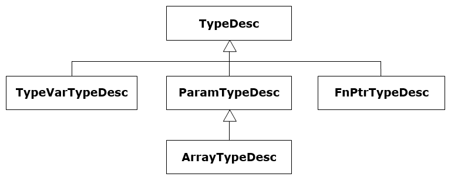
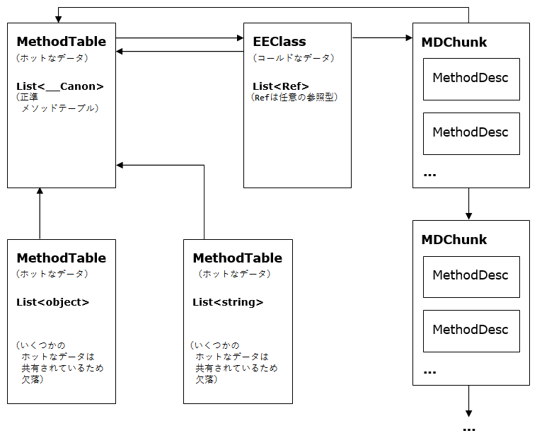

タイプローダーの設計
===

（これは https://github.com/dotnet/coreclr/blob/8d3936bff7ae46a5a964b15b5f0bc3eb8d4e32db/Documentation/botr/type-loader.md の日本語訳です。対象rev.は 8d3936b）

Author: Ladi Prosek - 2007

# はじめに

クラスベースのオブジェクト指向システムにおいて、型（type）は、個々のインスタンスが含むデータと提供する機能を記述するテンプレートです。最初に型を定義しないと、オブジェクトは作成できません1。2つのオブジェクトが同じ型のインスタンスの場合、それらは同じ型であると言えます。いずれにせよ、全く同じメンバーのセットを定義しているということによって、オブジェクトの間に関係性が生まれることはありません。

前の段落は典型的なC++システムについても言えます。CLRにとって必須のもう一つの機能は、完全な実行時型情報が使用可能なことです。マネージドコードを「マネージ」して、型安全な環境を提供するために、CLRはいかなるときでも任意のオブジェクトの型が分からなければなりません。そのような型情報は少ないコストですぐに使用可能でなければなりません。型のアイデンティティは非常に頻繁に問い合わせられると考えられるためです（たとえば、あらゆる型のキャストは、キャストが安全かつ実行可能であるかの検証のために、オブジェクトの型のアイデンティティを問い合わせることになります）。

このパフォーマンス要件によって、辞書検索による方式は除外され、以下の高レベルのアーキテクチャが選択肢として残ります。

図1 抽象的な高レベルのオブジェクトの設計

実際のインスタンスデータとは別に、各オブジェクトは、型を表現する構造体への単なるポインターである型IDを含みます。このコンセプトはC++のv-tableポインターによく似ていますが、我々が今、型（と呼び、この後詳細に説明するこの構造体は、単なるv-tableよりも多くのものを含んでいます。たとえば、型には「is-a」包含関係への問い合わせに回答可能なように、階層構造についての情報を含めなければなりません。

1 C#3.0には「匿名型」という機能があり、型を明示的に参照せずに、単にフィールドを直接列挙するだけでオブジェクトを定義できます。これについて誤解しないでください。この機能では、コンパイラによって背後で型が作成されています。

## 1.1 関連資料

[1] Martin Abadi, Luca Cardelli, A Theory of Objects, ISBN978-0387947754

[2] Andrew Kennedy ([@andrewjkennedy](https://github.com/andrewjkennedy)), Don Syme ([@dsyme](https://github.com/dsyme)), [Design and Implementation of Generics for the .NET Common Language Runtime][generics-design]

[generics-design]: http://research.microsoft.com/apps/pubs/default.aspx?id=64031

[3] [ECMA Standard for the Common Language Infrastructure (CLI)](http://www.ecma-international.org/publications/standards/Ecma-335.htm)

## 1.2 設計目標

タイプローダー（クラスローダーと呼ばれることもありますが、クラスはタイプ（型）のサブセット、具体的には参照型を構成するに過ぎず、タイプローダーは値型も読み込むので、厳密に言うと正確ではありません）の最終的な目標は、読み込みを依頼されている型を表現するデータ構造を構築することです。タイプローダーが持つべき特性は次のとおりです。

- 高速な型の検索（ルックアップ、[モジュール, トークン] => ハンドル の検索と [アセンブリ, 名前] => ハンドル の検索）。
- 良好なワーキングセットサイズ、キャッシュヒット率、JIT後コードのパフォーマンスを達成する、最適化されたメモリレイアウト。
- 型安全性。不正な型は読み込まれず、TypeLoadExceptionがスローされる。
- 同時実行性。マルチスレッド化された環境でうまくスケールする。

# 2 タイプローダーのアーキテクチャ

タイプローダーのエントリポイントの数はそれほど多くありません。個々のエントリポイントのシグネチャは若干異なっていますが、すべてよく似たセマンティクスを持っています。それらは、メタデータ **トークン** または **名前** 文字列の形での、型／メンバー指定、そのトークンのスコープ（**モジュール** または **アセンブリ**）、そしてフラグのような追加情報を受けとります。エントリポイントは **ハンドル** の形で読み込んだエンティティを返します。

一般的に、JITコンパイル中にタイプローダーへの呼び出しが多数行われます。次のコードを考えます。

	object CreateClass()
	{
	    return new MyClass();
	}

ILでは、MyClassはメタデータトークンを使用して参照されます。実際のインスタンス化を扱う **JIT\_New** ヘルパーへの呼び出しを生成するために、JITは型を読み込みんでそのハンドルを返すようタイプローダーに依頼します。このハンドルはJIT後のコード内に即値として直接埋め込まれます。型とメンバーの解決と読み込みが一般的に実行時ではなくJIT時に行われるという事実は、次のコードのように、挙動について容易に混乱されがちであることの説明にもなります。

	object CreateClass()
	{
	    try {
	        return new MyClass();
	    } catch (TypeLoadException) {
	        return null;
	    }
	}

**MyClass**の読み込みに失敗する、たとえばその型が別のアセンブリに定義されていて、最新のビルドではそのアセンブリが取り除かれていたような場合、このコードではまだ**TypeLoadException**がスローされます。なぜならば、catchブロックは実行されないものをcatchしないからです！ 例外はJITコンパイル中に発生し、その例外は**CreateClass**を呼び出してJITコンパイルを引き起こしたメソッドでのみcatchできます。さらに、インライン化のために、どこでJITコンパイルが行われるのかが常にはっきりしているとは限らないので、ユーザーは決定的な振る舞いについて期待も依存もすべきでありません。

## キーとなるデータ構造

CLR において最も広範に型を示すものは、**TypeHandle**です。これは**MethodTable**（**Systen.Object*や**List<string>**のような「普通」の型を表します）または**TypeDesc**（byref型、ポインター型、関数ポインター型、配列型、ジェネリック変数を表します）のいずれかへのポインターをカプセル化する抽象エンティティです。**TypeHandle**は型のアイデンティティを構成し、2つのハンドルはそれらが同じ型を表現している場合にのみ等しくなります。領域を節約するために、**TypeHandle**が**TypeDesc**を格納していることは、追加のフラグを使用するのではなく、ポインターの最下位から2つめのビットを1に設定する（すなわち、(ptr|2)とする）ことで示されます2。**TypeDesc**は「抽象」であり、以下の継承階層構造を持ちます。

図2 TypeDescの階層構造

**TypeDesc**

抽象的な型記述子。具象型としての記述子の型はフラグによって判別されます。

**TypeVarTypeDesc**

型変数、つまり**List<T>**や**Array.Sort<T>**の**T**を表します（後述するジェネリクスについてのパートを参照）。型変数は複数の型やメソッドの間で決して共有されないので、各変数はただ一つ所有者を持ちます。

**FnPtrTypeDesc**

関数ポインターを表し、本質的には戻り値の型とパラメーター群を参照する型ハンドル群の可変長リストです。C#によって関数ポインターがサポートされないため、この記述子を見ることはあまりありません。ただし、マネージドC++は関数ポインターを使用します。

**ParamTypeDesc**

この記述子はbyref型とポインター型を表します。byrefはC#の**ref**および**out**キーワードをメソッドのパラメーターに適用したもの3であるのに対し、ポインター型はアンセーフC#とマネージドC++で使用される、データへのアンマネージドポインターです。

**ArrayTypeDesc**

配列型を表します。これは **ParamTypeDesc** から派生します。配列は単一のパラメーター（要素の型）によってパラメータ化されるものでもあるためです。これは、パラメーターの数が可変であるジェネリック型のインスタンス化とは異なります。

**MethodTable**

これは、間違いなくCLRの中心となるデータ構造です。上記の分類のいずれかに当てはまらないあらゆる型（プリミティブ型と「オープン」「クローズド」両方のジェネリック型）を表します。MethodTableは、親の型、実装されたインターフェイス、v-tableのような、型の迅速な検索に必要なものをすべて含んでいます。

**EEClass**

**MethodTable**のデータは、ワーキングセットとキャッシュの利用の改善のために、「ホット」な構造体と「コールド」な構造体に分割されます。**MethodTable**自身は、プログラムの安定状態で必要となる「ホット」なデータのみを保存するためのものです。**EEClass**は、典型的には型の読み込み、JITコンパイル、またはリフレクションでのみ必要とされる「コールド」なデータを保存します。各**MethodTable**は1つの**EEClass**を指し示します。

さらに、**EEClass**はジェネリック型間で共有されます。複数のジェネリック型の**MethodTable**が単一の**EEClass**を指し示すことができます。この共有により、**EEClass**に保存可能なデータについて追加の制約が生じます。

**MethodDesc**

素直に、この構造体はメソッドを記述しています。実際には、対応する**MethodDesc**のサブタイプを持ついくつかの派生型がありますが、それらのほとんどは、完全にこの文書の範囲外です。ジェネリクスで重要な役割を演じる**InstantiatedMethodDesc**というサブタイプがあることだけ言っておけば十分でしょう。詳細については、[**メソッド記述子の設計**](method-descriptor.md) を参照してください。

**FieldDesc**

**MethodDesc**のように、この構造体はフィールドを記述します。特定のCOM相互運用のシナリオを除き、EEはプロパティとイベントについてまったく相手にしません。それらは最終的にはメソッドとフィールドに行きつき、コンパイラとリフレクションが、糖衣構文的なエクスペリエンスを提供するためにそれらを生成、理解するだけだからです。

<!-- 訳注：原文のinspectは文脈からポインタの逆参照と考えられる -->
2 これはデバッグには有用です。**TypeHandle**の値が2、6、A、またはEで終わる場合、それは**MethodTable**ではなく、かつその追加のビットを0にしなければ**TypeDesc**を得ることはできません。

3 **ref**と**out**の間の違いは、パラメーターの属性だけであることに注意してください。型システムの関心ごとに限って言えば、それらは両方とも同じ型です。

## 2.1 読み込みレベル

たとえばtypedef/typref/typespec**トークン**と**モジュール**によって識別される、特定の型の読み込みがタイプローダーに依頼されたとき、タイプローダーはすべての作業を一度に原子的に行うわけではありません。読み込み処理は複数のフェーズで行われます。その理由は、一般的に型は他の型に依存しており、他の型から参照可能になるときまでに完全に読み込み済となっている必要があるとすると、無限再帰やデッドロックを引き起こすためです。以下を考えます。

	classA<T> : C<B<T>>
	{ }

	classB<T> : C<A<T>>
	{ }

	classC<T>
	{ }

これらは妥当な型定義であり、明らかに**A**は**B**に依存しており、**B**は**A**に依存しています。

タイプローダーは最初に型を表現する構造体（群）を作成し、他の型を読み込むことなく取得できるデータを使用してそれらの構造体を初期化します。この「依存先のない」作業が完了すると、構造体（群）は他の場所から参照可能、一般的にはそれらの構造体へのポインターを別の構造体の中に組み入れられるようになります。その後で、タイプローダーは繰り返し手順を踏んで処理を進め、最終的に完全に読み込み済みの型になるまで、次々に情報を構造体（群）に入れていきます。上記の例では、**A**と**B** の基底型は他の型を含まない何かによって近似的に形成され、後から本物の値で置換されます。

まさにこの途中まで読み込まれた状態は、CLASS\_LOAD\_BEGINで始まりCLASS\_LOADEDで終わり、その間に複数の中間レベルを持つ、いわゆる読み込みレベルによって記述されます。[classloadlevel.h](https://github.com/dotnet/coreclr/blob/master/src/vm/classloadlevel.h)ソースファイルには、個別の読み込みレベルについての豊富かつ有用なコメントがあります。型はNGENイメージに保存できますが、型を表現する構造体は、「復元処理（restoring）」と呼ばれる追加の処理なしに、メモリへの単純にマッピングや転送をすることはできません。型がNGENイメージから取り出され、復元が必要であるということも、それ用の読み込みレベルで表されます。

読み込みレベルの詳細については、[『Design and Implementation of Generics for the .NET Common Language Runtime』][generics-design]を参照してください。

## 2.2 ジェネリクス

ジェネリクスのない世界では、すべてが上手く行き、みんな幸せです。すべての普通の（**TypeDesc**で表されない）型は1つの**MethodTable**を持ち、それは関連する**EEClass**を指し示し、その**EEClass**は**MethodTable**を指し返します。型のすべてのインスタンスはオフセット0、すなわち参照型のアドレスの位置にある最初のフィールドとして**MethodTable**へのポインターを保持します。領域を節約するために、その型で宣言されたメソッドを表す**MethodDesc**は、**EEClass**から指し示されるチャンクのリンクリストとして編成されます4。

図3 非ジェネリックメソッドを持つ非ジェネリック型

4 言うまでもなく、マネージドコードが実行されるときに、チャンクからのルックアップでメソッドを呼び出すことはしません。メソッド呼び出しは大いに「ホット」な操作であり、通常は**MethodTable**内の情報にアクセスするだけで済みます。

### 2.2.1 用語

**ジェネリックパラメーター**

別の型によって実体が置き換えられるプレースホルダーで、**List<T>**の宣言における**T**です。形式的型パラメーター（formal type parameter）と呼ばれることもあります。ジェネリックパラメーターは名前と、省略可能なジェネリック制約を持ちます。

**ジェネリック実引数**

ジェネリックパラメーターを実体として置き換える型で、**List<int>**の**int**です。ジェネリックパラメーターは実引数として使用されることもあることに注意してください。次のコードを考えます：

	List<T> GetList<T>()
	{
	    return new List<T>();
	}

このメソッドはジェネリックパラメーター**T**を持ち、これがジェネリックリストクラスのジェネリック実引数として使用されています。

**ジェネリック制約**

ジェネリック実引数となり得るものについて、ジェネリックパラメーターによって指定される省略可能な要件。要件となる特性を持たない型で、ジェネリックパラメーターを実体として置き換えることはできません。これはタイプローダーによって強制されます。ジェネリック制約は3種類あります。

1. 限定制約（special constraints）
  - 参照型制約 - そのジェネリック実引数は参照型でなくてはなりません（値型であってはなりません）。この制約を表現するのに、C#では`class`キーワードが使用されます。

			public class A<T> where T : class

  - 値型制約 - そのジェネリック実引数は`System.Nullable<T>`でない値型でなければなりません。C#では`struct`キーワードを使用します。

			public class A<T> where T : struct

  - 既定のコンストラクター制約 - そのジェネリック実引数はpublicでパラメーターのないコンストラクターを持たなければなりません。C#では`new()`で表現されます。

			public class A<T> where T : new()

2. 基底型制約 - そのジェネリック実引数は、指定された非インターフェイス型から派生する（かその型そのもの）でなければなりません。基底型制約として、0または1の参照型のみを使用できることは言うまでもありません。

		public class A<T> where T : EventArgs

3. 実装済みインターフェイス制約 - そのジェネリック実引数は指定されたインターフェイス型を実装（かその型そのもの）でなければなりません。0以上のインターフェイスを指定できます。

		public class A<T> where T : ICloneable, IComparable<T>

上記の制約は暗黙的なANDで組み合わせられる、つまり、あるジェネリックパラメーターはある型から派生し、いくつかのインターフェイスを実装し、かつ既定のコンストラクターを持つように、制約を付与できます。ジェネリックパラメーターを宣言する型のすべてのジェネリックパラメーターは、制約を表現するために使用でき、それによってパラメーター間の相互依存を導入できます。例：

	public class A<S, T, U> 
		where S : T 
		where T : IList<U> {
	    void f<V>(V v) where V : S {}
	}

<!-- 訳注：インスタンス化ではニュアンスが違うので。インスタンス化物？ -->
**インスタンシエーション（instantiation）**

ジェネリック型またはジェネリックメソッドのジェネリックパラメーターについて、実体に置き換えられたジェネリック引数のリスト。読み込み済みのジェネリック型およびジェネリックメソッドは、それぞれインスタンシエーションを持ちます。

**象徴インスタンシエーション（typical instantiation）**

純粋に型またはメソッド自身の型パラメーターのみでなり、かつパラメーターの宣言順と同じ順序でのインスタンシエーションです。ジェネリック型およびジェネリックメソッドには、それぞれただ1つの典型インスタンシエーションが存在します。一般的に、誰かがオープンジェネリック型について議論するときには、その象徴インスタンシエーションを念頭においています。例：

	public class A<S, T, U> {}

C#の`typeof(A<,,>)`はldtoken A\'3にコンパイルされ、これによってCLR は**S**,**T**,**U**でインスタンス化された**A`3**を読み込みます。

**正準インスタンシエーション（canonical instantiation）**

すべてのジェネリック実引数が**System.\_\_Canon**であるインスタンシエーションです。**System.\_\_Canon**は**mscorlib**で定義される内部型で、その役割は、それが既知の型であるということと、ジェネリック実引数として使用され得る他のあらゆる型と区別されることだけです。正準インスタンシエーションされた型またはメソッドは、すべてのインスタンシエーションの代表として使用され、かつすべてのインスタンシエーションによって共有される情報を伝えます。明らかに、**System.\_\_Canon**が、個別のジェネリックパラメーターが持ちうる制約を一切満たせないので、制約チェック処理は特別なケースとなり、**System.\_\_Canon**を尊重して、制約違反を無視します。

### 2.2.2 共有（sharing）

ジェネリクスの到来により、ランタイムによって読み込まれる型の数が多くなりがちになります。異なるインスタンス化を伴うジェネリック型（たとえば**List&lt;string>**と**List&lt;object>**）はそれぞれの**MethodTable**を持つ異なる型ですが、共有可能な情報が無視できないくらい大量にあることがわかります。この共有によって、メモリのフットプリント、ひいてはパフォーマンスが改善されます。

図 4 非ジェネリックメソッドを持つジェネリック型 - EEClassの共有

現在、参照型を含むすべてのインスタンシエーションは同一の**EEClass**とその**MethodDesc**を共有します。これは、すべての参照が同じサイズ（4または8バイト）であり、したがってこれらの型のレイアウトがすべて同一であるために実現できます。上記の図は**List&lt;object>**と**List&lt;string>**について、このことを説明しています。正準**MethodTable**は最初の参照型インスタンシエーションが読み込まれる前に自動的に作成され、非仮想スロットや**RemotableMethodInfo**のような、ホットであるがインスタンシエーション固有でないデータを含みます。値型のみを含むインスタンシエーションは共有されず、そのようにインスタンシエーションされた型たちは自前の共有されない**EEClass**を得ます。

ここまで読み込まれたジェネリック型を表す**MethodTable**は、ローダーモジュールによって所有されるハッシュテーブルにキャッシュされます5。このハッシュテーブルは新しいインスタンシエーションが構築される前に調査され、同じ型を表す**MethodTable**のインスタンスが2つ以上できないようにします。

ジェネリックの共有について詳細情報は、[『Design and Implementation of Generics for the .NET Common Language Runtime』][generics-design]を参照してください。

5 NGENイメージから読み込まれた型の場合、若干複雑になります。
