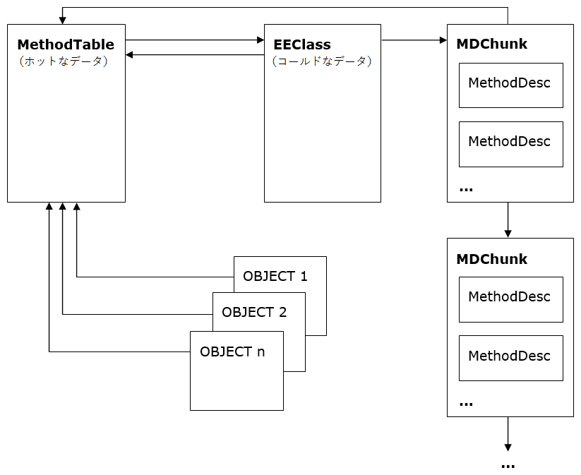

Type Loader Design
タイプローダーの設計
===

Author: Ladi Prosek - 2007

# Introduction
# はじめに

In a class-based object oriented system, types are templates describing the data that individual instances will contain, and the functionality that they will provide. It is not possible to create an object without first defining its type1.  Two objects are said to be of the same type if they are instances of the same type. The fact that they define the exact same set of members does not make them related in any way.
クラスベースのオブジェクト指向システムにおいて、型（type）とは個別のインスタンスが含むことになるデータと、インスタンスが提供することになる機能を記述するテンプレートです。まず型を定義することなくオブジェクトを作成することはできません1。2 つのオブジェクトは、それらが同じ型のインスタンスの場合に同じ型であると言えます。いずれにせよ、全く同じメンバーの集合を定義しているということで、それらの間に関連が生まれることはありません。

The previous paragraph could as well describe a typical C++ system. One additional feature essential to CLR is the availability of full runtime type information. In order to "manage" the managed code and provide type safe environment, the runtime must know the type of any object at any time. Such a type information must be readily available without extensive computation because the type identity queries are expected to be rather frequent (e.g. any type-cast involves querying the type identity of the object to verify that the cast is safe and can be done).
前の段落は典型的な C++ システムについても言えます。CLR におけるもう一つの基礎的な機能は、完全な実行時型情報が使用可能なことです。マネージドコードを「マネージ」して、型安全な環境を提供するために、CLR はいかなるときでも任意のオブジェクトの型が分からなければなりません。そのような型情報は少ないコストですぐに使用可能でなければなりません。型のアイデンティティの問い合わせは非常に頻繁であると考えられるためです（たとえば、任意の型のキャストは、キャストが安全かつ実行可能であるかの検証のために、オブジェクトの型のアイデンティティを問い合わせることになります）。

This performance requirement rules out any dictionary look up approaches and leaves us with the following high-level architecture.
このパフォーマンス要件によって、何らかの辞書検索方式が規定され、以下の高レベルのアーキテクチャが示されます。

Figure 1 The abstract high-level object design
図1 抽象的かつ高レベルのオブジェクトの設計

Apart from the actual instance data, each object contains a type id which is simply a pointer to the structure that represents the type. This concept is similar to C++ v-table pointers, but the structure, which we call TYPE now and will define it more precisely later, contains more than just a v-table. For instance, it has to contain information about the hierarchy so that "is-a" subsumption questions can be answered.
実際のインスタンスデータとは別に、各オブジェクトは、型を表現する構造体への単なるポインターである型 ID を含みます。このコンセプトは C++ の v-table ポインターによく似ていますが、我々が今、型（TYPE）と呼んでおり、この後詳細に説明する構造体は、単なる v-table よりも多くのものを含んでいます。たとえば、型には「is-a」包含関係への問い合わせに回答可能なように、階層構造についての情報を含まなければなりません。

1 The C# 3.0 feature called "anonymous types" lets you define an object without explicit reference to a type - simply by directly listing its fields. Don't let this fool you, there is in fact a type created behind the scenes for you by the compiler.
1 C# 3.0 の機能は「匿名型」という機能があり、型を明示的に参照せずに、単にフィールドを直接列挙するだけでオブジェクトを定義できます。これについて誤解しないでください。この機能は、コンパイラによって背後で型が作成されています。

## 1.1 Related Reading
## 1.1 関連資料

[1] Martin Abadi, Luca Cardelli, A Theory of Objects, ISBN
978-0387947754

[2] Andrew Kennedy ([@andrewjkennedy](https://github.com/andrewjkennedy)), Don Syme ([@dsyme](https://github.com/dsyme)), [Design and Implementation of Generics
for the .NET Common Language
Runtime][generics-design]

[generics-design]: http://research.microsoft.com/apps/pubs/default.aspx?id=64031

[3] [ECMA Standard for the Common Language Infrastructure (CLI)](http://www.ecma-international.org/publications/standards/Ecma-335.htm)

## 1.2 Design Goals
## 1.2 設計目標

The ultimate purpose of the type loader (sometimes referred to as the class loader, which is strictly speaking not correct, because classes constitute just a subset of types - namely reference types - and the loader loads value types as well) is to build data structures representing the type which it is asked to load. These are the properties that the loader should have:
タイプローダー（クラスローダーと呼ばれることもありますが、クラスはタイプ（型）のサブセット、具体的には参照型を構成するに過ぎず、タイプローダーは値型も読み込むので、厳密に言うと正確ではありません）の最終的な目標は、読み込みを依頼されている型を表現するデータ構造を構築することです。タイプローダーが持つべき特性は以下のとおりです。

- Fast type lookup ([module, token] => handle and [assembly, name] => handle).
- 高速な型の検索（ルックアップ、[モジュール, トークン] => ハンドル の検索と [アセンブリ, 名前] => ハンドル の検索）。
- Optimized memory layout to achieve good working set size, cache hit rate, and JITted code performance.
- 良好なワーキングセットサイズ、キャッシュヒット率、および JIT 後のコードのパフォーマンスを達成する、最適化されたメモリレイアウト。
- Type safety - malformed types are not loaded and a TypeLoadException is thrown.
- 型安全性。不正な型は読み込まれず、TypeLoadException がスローされる。
- Concurrency - scales well in multi-threaded environments.
- 同時実行性。マルチスレッド化された環境でうまくスケールする。

# 2 Type Loader Architecture
# 2 タイプローダーのアーキテクチャ

There is a relatively small number of entry-points to the loader. Although the signature of each individual entry-point is slightly different, they all have the similar semantics. They take a type/member designation in the form of a metadata **token** or a **name** string, a scope for the token (a **module** or an **assembly** ), and some additional information like flags. They return the loaded entity in the form of a **handle**.
タイプローダーのエントリポイントの数は比較的多くありません。個々のエントリポイントのシグネチャは若干異なっていますが、すべて同じようなセマンティクスを持っています。それらは、メタデータ **トークン** または **名前** 文字列の形での型／メンバー指定、そのトークンのスコープ（**モジュール** または **アセンブリ**）、そしてフラグ群のような何らかの追加情報を受けとります。それらは **ハンドル** の形で読み込んだエンティティを返します。

There are usually many calls to the type loader during JITting. Consider:
一般的に、JIT コンパイル中にタイプローダーへの多数の呼び出しが行われます。以下を考えます。

	object CreateClass()
	{
	    return new MyClass();
	}

In the IL, MyClass is referred to using a metadata token. In order to generate a call to the **JIT\_New** helper which takes care of the actual instantiation, the JIT will ask the type loader to load the type and return a handle to it. This handle will be then directly embedded in the JITted code as an immediate value. The fact that types and members are usually resolved and loaded at JIT time and not at run-time also explains the sometimes confusing behavior easily hit with code like this:
IL では、MyClass はメタデータトークンを使用して参照されます。実際のインスタンス化を扱う **JIT\_New** ヘルパーへの呼び出しを生成するために、JIT はタイプローダーに型の読み込みんでそのハンドルを返すよう依頼します。このハンドルは即値として JIT 後のコード内に直接埋め込まれます。型とメンバーの解決と読み込みは、一般的に実行時ではなく JIT 時に行われるという事実は、以下のコードにあるような、挙動についての混乱が容易に引き起こされがちであることも説明します。

	object CreateClass()
	{
	    try {
	        return new MyClass();
	    } catch (TypeLoadException) {
	        return null;
	    }
	}

If **MyClass** fails to load, for example because it's supposed to be defined in another assembly and it was accidentally removed in the newest build, then this code will still throw **TypeLoadException**. The reason that the catch block did not catch it is that it never ran! The exception occurred during JITting and would only be catchable in the method that called **CreateClass** and caused it to be JITted. In addition, it may not be always obvious at which point the JITting is triggered due to inlining, so users should not expect and rely on deterministic behavior.
**MyClass** の読み込みに失敗する、たとえばその型が別のアセンブリに定義されていて、最新のビルドではそのアセンブリが取り除かれていたような場合、このコードでは依然として **TypeLoadException** がスローされます。何故ならば、catch ブロックは実行されることのないものを catch しないからです！ 例外は JIT コンパイル中に発生し、その例外は **CreateClass** を呼び出して JIT コンパイルを引き起こしたメソッドでのみ catch できます。さらに、インライン化のためにどこで JIT コンパイルが行われるのかが常にはっきりしているとは限らないので、ユーザーはk徹底的な振る舞いを期待および依存するすべきでありません。

## Key Data Structures
## キーとなるデータ構造

The most universal type designation in the CLR is the **TypeHandle**. It's an abstract entity which encapsulates a pointer to either a **MethodTable** (representing "ordinary" types like **System.Object** or **List<string>** ) or a **TypeDesc** (representing byrefs, pointers, function pointers, arrays, and generic variables). It constitutes the identity of a type in that two handles are equal if and only if they represent the same type. To save space, the fact that a **TypeHandle** contains a **TypeDesc** is indicated by setting the second lowest bit of the pointer to 1 (i.e. (ptr | 2)) instead of using additional flags2. **TypeDesc** is "abstract" and has the following inheritance hierarchy.
CLR において最も広範に型を示すものは、**TypeHandle** です。これは **MethodTable**（**Systen.Object*: や **List<string>** のような「普通」の型を表します）または **TypeDesc**（byref 型、ポインター型、関数ポインター型、配列型、ジェネリック変数を表します）のいずれかへのポインターをカプセル化する抽象エンティティです。**TypeHandle** は型のアイデンティティを構成し、2 つのハンドルはそれらが同じ型を表現している場合、その場合にのみ等しくなります。領域を節約するために、**TypeHandle** が **TypeDesc** を格納しているという事実は、追加のフラグを使用するのではなく、ポインターの最下位から 2 つめのビットを 1 に設定する（すなわち、(ptr|2) とする）ことで示されます2。**TypeDesc** は「抽象」であり、以下の継承階層構造を持ちます。

Figure 2 The TypeDesc hierarchy

**TypeDesc**

Abstract type descriptor. The concrete descriptor type is determined by flags.
抽象型記述子。具体的な記述子の型はフラグによって判別されます。

**TypeVarTypeDesc**

Represents a type variable, i.e. the **T** in **List<T>** or in **Array.Sort<T>** (see the part about generics below). Type variables are never shared between multiple types or methods so each variable has its one and only owner.
型変数、つまり **List<T>** や **Array.Sort<T>** の **T** を表します（後述するジェネリクスについての部分を参照）。型変数は複数の型やメソッドの間で決して共有されないので、各変数は唯一固有の所有者があります。

**FnPtrTypeDesc**

Represents a function pointer, essentially a variable-length list of type handles referring to the return type and parameters. It's not that common to see this descriptor because function pointers are not supported by C#. However, managed C++ uses them.
関数ポインターを表し、本質的には戻り値の型とパラメーター群を参照する方ハンドル群の可変長リストです。C# によって関数ポインターはサポートされないため、この記述子を見ることはあまりありません。ただし、マネージド C++ は関数ポインターを使用します。

**ParamTypeDesc**

This descriptor represents a byref and pointer types. Byrefs are the results of the **ref** and **out** C# keywords applied to method parameters3 whereas pointer types are unmanaged pointers to data used in unsafe C# and managed C++.
この記述子は byref 型とポインター型を表します。byref は C# の **ref** および **out** キーワードをメソッドのパラメーターに適用した結果3なのに対し、ポインター型はアンセーフ C# とマネージド C++ で使用されるデータへのアンマネージドポインターです。

**ArrayTypeDesc**

Represents array types. It is derived from **ParamTypeDesc** because arrays are also parameterized by a single parameter (the type of their element). This is opposed to generic instantiations whose number of parameters is variable.
配列型を表します。これは **ParamTypeDesc** から派生します。配列は単一のパラメーター（要素の型）によってパラメータ化されるものでもあるためです。これは、パラメーターの数が可変であるジェネリック型のインスタンス化とは異なります。

**MethodTable**

This is by far the central data structure of the runtime. It represents any type which does not fall into one of the categories above (this includes primitive types, and generic types, both "open" and "closed"). It contains everything about the type that needs to be looked up quickly, such as its parent type, implemented interfaces, and the v-table.
これは、間違いなく CLR の中心となるデータ構造です。上記の分類のいずれかに当てはまらないあらゆる型（プリミティブ型と「オープン」「クローズド」両方のジェネリック型）を表します。MethodTable は、親の型、実装されたインターフェイス、v-table のような、型が迅速に検索されるのに必要なものをすべて含んでいます。

**EEClass**

**MethodTable** data are split into "hot" and "cold" structures to improve working set and cache utilization. **MethodTable** itself is meant to only store "hot" data that are needed in program steady state. **EEClass** stores "cold" data that are typically only needed by type loading, JITing or reflection. Each **MethodTable** points to one **EEClass**.
**MethodTable** のデータは、ワーキングセットとキャッシュの利用の改善のために、「ホット」構造体と「コールド」構造体に分割されます。**MethodTable** 自身は、プログラムの安定的な状態で必要となる「ホット」データのみを保存するためのものです。**EEClass** は、一般的には型の読み込み、JIT コンパイル、またはリフレクションでのみ必要とされる「コールド」データを保存します。各 **MethodTable** は 1 つの **EEClass** を指し示します。

Moreover, **EEClasse**s are shared by generic types. Multiple generic type **MethodTable**s can point to single **EEClass**. This sharing adds additional constrains on data that can be stored on **EEClass**.
さらに、**EEClass** はジェネリック型間で共有されます。複数のジェネリック型の **MethodTable** は単一の **EEClass** を指し示すことができます。この共有により、**EEClass** に保存可能なデータには追加の制約が加わっています。

**MethodDesc**

It is no surprise that this structure describes a method. It actually comes in a few flavors which have their corresponding **MethodDesc** subtypes but most of them really are out of the scope of this document. Suffice it to say that there is one subtype called **InstantiatedMethodDesc** which plays an important role for generics. For more information please see [**Method Descriptor Design**](method-descriptor.md).
この構造体はメソッドを記述しています。そのままですね。実際には、それぞれが対応する **MethodDesc** のサブタイプを持ついくつかの派生型がありますが、それらのほとんどは、まったくもってこの文書の範囲外です。ジェネリクスで重要な役割を演じる **InstantiatedMethodDesc** というサブタイプがあることだけ言っておけば十分でしょう。詳細については、[**メソッド記述子の設計**](method-descriptor.md) を参照してください。

**FieldDesc**

Analogous to **MethodDesc** , this structure describes a field. Except for certain COM interop scenarios, the EE does not care about properties and events at all because they boil down to methods and fields at the end of the day, and it's just compilers and reflection who generate and understand them in order to provide that syntactic sugar kind of experience.
**MethodDesc** のように、この構造体はフィールドを記述します。特定の COM 相互運用のシナリオを除き、EE はプロパティとイベントについてまったく相手にしません。それらは最終的にはメソッドとフィールドに行きつき、コンパイラとリフレクションが、糖衣構文的なエクスペリエンスを提供するためにそれらを生成及び理解するだけだからです。

2 This is useful for debugging. If the value of a **TypeHandle** ends with 2, 6, A, or E, then it's not a **MethodTable** and the extra bit has to be cleared in order to successfully inspect the **TypeDesc**.
2 これはデバッグには有用です。**TypeHandle** の値が 2、6、A、または E で終わる場合、それは **MethodTable** ではなく、かつ **TypeDesc** を上手く調査するには追加ビットが 0 でなければなりません。

3 Note that the difference between **ref** and **out** is just in a parameter attribute. As far as the type system is concerned, they are both the same type.
3 **ref** と **out** の間の違いは、パラメーターの属性だけであることに注意してください。型システムの関心ごとに限って言えば、それらは両方とも同じ型です。

## 2.1 Load Levels
## 2.1 読み込みレベル

When the type loader is asked to load a specified type, identified for example by a typedef/typeref/typespec **token** and a **Module** , it does not do all the work atomically at once. The loading is done in phases instead. The reason for this is that the type usually depends on other types and requiring it to be fully loaded before it can be referred to by other types would result in infinite recursion and deadlocks. Consider:
たとえば typedef/typref/typespec **トークン** と **モジュール** によって識別される特定の型の読み込みがタイプローダーに依頼されたとき、タイプローダーはすべての作業を一度に原子的に行うわけではありません。読み込み処理は複数のフェーズで行われます。その理由は、型は一般的に他の方に依存しており、他の型から参照可能になるまでに完全に読み込み済となっている必要があるとすると無限再帰やデッドロックを引き起こすためです。以下を考えます。

	classA<T> : C<B<T>>
	{ }

	classB<T> : C<A<T>>
	{ }

	classC<T>
	{ }

These are valid types and apparently **A** depends on **B** and **B** depends on **A**.
これらは妥当な型定義であり、明らかに **A** は **B** に依存しており、**B** は **A** に依存しています。

The loader initially creates the structure(s) representing the type and initializes them with data that can be obtained without loading other types. When this "no-dependencies" work is done, the structure(s) can be referred from other places, usually by sticking pointers to them into another structures. After that the loader progresses in incremental steps and fills the structure(s) with more and more information until it finally arrives at a fully loaded type. In the above example, the base types of **A** and **B** will be approximated by something that does not include the other type, and substituted by the real thing later.
ローダーは最初に型を表現する構造体（群）を作成し、他の型を読み込むことなく取得できるデータを使用してそれらの構造体を初期化します。この「依存先のない」作業が完了すると、構造体（群）は他の場所から参照可能、一般的にはそれらの構造体へのポインターを別の構造体の中に組み入れられるようになります。その後で、ローダーは繰り返し手順を踏んで処理を進め、最終的に完全に読み込み済みの型にたどり着くまで次々に情報を構造体（群）に入れていきます。上記の例では、 **A** と **B** の基底型は他の型を含まない何かによって近似的に形成され、後から本物の値で置換されます。

The exact half-loaded state is described by the so-called load level, starting with CLASS\_LOAD\_BEGIN, ending with CLASS\_LOADED, and having a couple of intermediate levels in between. There are rich and useful comments about individual load levels in the [classloadlevel.h](https://github.com/dotnet/coreclr/blob/master/src/vm/classloadlevel.h) source file. Notice that although types can be saved in NGEN images, the representing structures cannot be simply mapped or blitted into memory and used without additional work called "restoring". The fact that a type came from an NGEN image and needs to be restored is also captured by its load level.
まさにこの途中まで読み込まれた状態は、CLASS\_LOAD\_BEGIN で始まり CLASS\_LOADED で終わり、その間に複数の中間レベルを持つ、いわゆる読み込みレベルによって記述されます。[classloadlevel.h](https://github.com/dotnet/coreclr/blob/master/src/vm/classloadlevel.h) ソースファイルには、個別の読み込みレベルについての豊富かつ有用なコメントがあります。型は NGEN イメージに保存できますが、型を表現する構造体は、「復元処理」と呼ばれる追加の処理なしには、メモリ内に簡単に対応付けまたは転送することができません。事実として、NGEN イメージから取り出され復元が必要な方も、その読み込みレベルで記述されます。

See [Design and Implementation of Generics for the .NET Common Language Runtime][generics-design] for more detailed explanation of load levels.
読み込みレベルの詳細については、[Design and Implementation of Generics for the .NET Common Language Runtime][generics-design] を参照してください。

## 2.2 Generics
## 2.2 ジェネリクス

In the generics-free world, everything is nice and everyone is happy because every ordinary (not represented by a **TypeDesc**) type has one **MethodTable** pointing to its associated **EEClass** which in turn points back to the **MethodTable**. All instances of the type contain a pointer to the **MethodTable** as their first field at offset 0, i.e. at the address seen as the reference value. To conserve space, **MethodDescs** representing methods declared by the type are organized in a linked list of chunks pointed to by the **EEClass**4.
ジェネリクスのない世界では、すべてが上手く行き、みんな幸せです。すべての普通の（**TypeDesc** で表されない）型は 1 つの **MethodTable** を持ち、それは関連する **EEClass** を指し示し、その **EEClass** は **MethodTable** を指し返します。型のすべてのインスタンスはオフセット 0、すなわち参照型のアドレスの位置にある最初のフィールドとして **MethodTable** へのポインターを保持します。領域を conserve するために、その型で宣言されたメソッドを表す **MethodDesc** は **EEClass** によって指し示されるチャンクのリンクリストとして編成されます4。★

Figure 3 Non-generic type with non-generic methods
図 3 非ジェネリックメソッドを持つ非ジェネリック型

4 Of course, when managed code runs, it does not call methods by looking them up in the chunks. Calling a method is a very "hot" operation and normally needs to access only information in the **MethodTable**.
4 言うまでもなく、マネージドコードが実行されるときに、チャンク内をルックアップすることでメソッドを呼び出すことはしません。メソッド呼び出しは大いに「ホット」な操作であり、通常は **MethodTable** 内の情報にアクセスするだけで済みます。

### 2.2.1 Terminology
### 2.2.1 用語

**Generic Parameter**
**ジェネリックパラメーター**

A placeholder to be substituted by another type; the **T** in the declaration of **List<T>**. Sometimes called formal type parameter. A generic parameter has a name and optional generic constraints.
別の型によって実体が置き換えられるプレースホルダーで、 **List<T>** の宣言における **T** です。形式的型パラメーター（formal type parameter）と呼ばれることもあります。ジェネリックパラメーターは名前と、省略可能なジェネリック制約を持ちます。

**Generic Argument**
**ジェネリック実引数**

A type being substituted for a generic parameter; the **int** in **List<int>**. Note that a generic parameter can also be used as an argument. Consider:
ジェネリックパラメーターを実体として置き換える型で、**List<int>** の **int** です。ジェネリックパラメーターは実引数として使用されることもあることに注意してください。次のコードを考えます：

	List<T> GetList<T>()
	{
	    return new List<T>();
	}

The method has one generic parameter **T** which is used as a generic argument for the generic list class.
このメソッドはジェネリックパラメーター **T** を持ち、これがジェネリックリストクラスのジェネリック実引数として使用されています。

**Generic Constraint**
**ジェネリック制約**

An optional requirement placed by generic parameters on its potential generic arguments. Types that do not have the required properties may not be substituted for the generic parameter and it is enforced by the type loader. There are three kinds of generic constraints:
ジェネリック実引数となり得るものに対してジェネリックパラメーターによって指定される省略可能な要件。必要とされる特性を持たない型は、ジェネリックパラメーターの実体として置き換えることはできず、これはタイプローダーによって強制されます。ジェネリック制約には 3 種類あります。

1. Special constraints
1. 限定制約
  - Reference type constraint - the generic argument must be a reference type (as opposed to a value type). The `class` keyword is used in C# to express this constraint.
  - 参照型制約 - そのジェネリック実引数は参照型でなくてはなりません（値型であってはなりません）。この制約を表現するのに、C# では `class` キーワードが使用されます。

			public class A<T> where T : class

  - Value type constraint - the generic argument must be a value type different from `System.Nullable<T>`. C# uses the `struct` keyword.
  - 値型制約 - そのジェネリック実引数は `System.Nullable<T>` でない値型でなければなりません。C# では `struct` キーワードを使用します。

			public class A<T> where T : struct

  - Default constructor constraint - the generic argument must have a public parameterless constructor. This is expressed by `new()` in C#.
  - 既定のコンストラクター制約 - そのジェネリック実引数は public でパラメーターのないコンストラクターを持たなければなりません。C# では `new()` で表現されます。

			public class A<T> where T : new()

2. Base type constraints - the generic argument must be derived from (or directly be of) the given non-interface type. It obviously makes sense to use only zero or one reference type as a base types constraint.
2. 基底型制約 - そのジェネリック実引数は、指定された非インターフェイス型から派生する（かその型そのもの）でなければなりません。基底型制約として、0 または 1 つの参照型のみを使用できることは言うまでもありません。

		public class A<T> where T : EventArgs

3. Implemented interface constraints - the generic argument must implement (or directly be of) the given interface type.  Zero or more interfaces can be given.
3. 実装済みインターフェイス制約 - そのジェネリック実引数は指定されたインターフェイス型を実装（かその型そのもの）でなければなりません。0 以上のインターフェイスを指定できます。

		public class A<T> where T : ICloneable, IComparable<T>

The above constraints are combined with an implicit AND, i.e. a generic parameter can be constrained to be derived from a given type, implement several interfaces, and have the default constructor. All generic parameters of the declaring type can be used to express the constraints, introducing interdependencies among the parameters. For
example:
上記の制約は暗黙的な AND で組み合わせられる、つまり、あるジェネリックパラメーターはある型から派生し、いくつかのインターフェイスを実装し、かつ既定のコンストラクターを持つように制約を付与できます。ジェネリックパラメーターを宣言する型のすべてのジェネリックパラメーターは制約を表現するために使用し、パラメーター間の相互依存性を導入できます。例：

	public class A<S, T, U> 
		where S : T 
		where T : IList<U> {
	    void f<V>(V v) where V : S {}
	}

**Instantiation**
**インスタンス化**

The list of generic arguments that were substituted for generic
parameters of a generic type or method. Each loaded generic type and
method has its instantiation.

**Typical Instantiation**
**典型インスタンス化**

An instantiation consisting purely of the type's or method's own type parameters and in the same order in which the parameters are declared. There exists exactly one typical instantiation for each generic type and method. Usually when one talks about an open generic type, they have the typical instantiation in mind. Example:
純粋に型またはメソッド自身の型パラメーターのみを含み、かつパラメーターの宣言順と同じ順序でのインスタンス化です。各ジェネリック型およびジェネリックメソッドには、ただ 1 つの典型インスタンス化が存在します。一般的に、誰かがオープンジェネリック型について議論するときには、その典型インスタンス化を念頭においています。例：

	public class A<S, T, U> {}

The C# `typeof(A<,,>)` compiles to ldtoken A\'3 which makes the runtime load **A`3** instantiated at **S** , **T** , **U**.
C# の `typeof(A<,,>)` は ldtoken A\'3 にコンパイルされ、これによって CLR は **S** , **T** , **U** でインスタンス化された **A`3** を読み込みます。

**Canonical Instantiation**
**正準インスタンス化**

An instantiation where all generic arguments are **System.\_\_Canon**. **System.\_\_Canon** is an internal type defined in **mscorlib** and its task is just to be well-known and different from any other type which may be used as a generic argument. Types/methods with canonical instantiation are used as representatives of all instantiations and carry information shared by all instantiations. Since **System.\_\_Canon** can obviously not satisfy any constraints that the respective generic parameter may have on it, constraint checking is special-cased with respect to **System.\_\_Canon** and ignores these violations.
すべてのジェネリック実引数が **System.\_\_Canon** であるインスタンス化です。**System.\_\_Canon** は **mscorlib** で定義される内部型で、その役割は、それが単に既知の型であるということと、ジェネリック実引数として使用され得る他のあらゆる型と区別されることです。正準インスタンス化された型またはメソッドは、すべてのインスタンス化の representatives として使用され、かつすべてのインスタンス化によって共有される情報を運びます。 **System.\_\_Canon** が、respective なジェネリックパラメーターが持ちうる一切の制約を満たせないことは明らかなので、制約チェック機能は **System.\_\_Canon** を尊重して特別なケースとして扱い、これらの違反を無視します。★
**System.\_\_Canon**

### 2.2.2 Sharing
### 2.2.2 共有

With the advent of generics, the number of types loaded by the runtime tends to be higher. Although generic types with different instantiations (for example **List&lt;string>** and **List&lt;object>**) are different types each with its own **MethodTable** , it turns out that there is a considerable amount of information that they can share. This sharing has a positive impact on the memory footprint and consequently also performance.
ジェネリクスの advent により、ランタイムによって読み込まれる型の数が多くなる傾向にあります。異なるインスタンス化を伴うジェネリック型（たとえば **List&lt;string>** と **List&lt;object>**）はそれぞれの **MethodTable** を持つ異なる型ですが、共有可能な情報が無視できないくらい大量にあることがわかります。この共有はメモリのフットプリント、ひいてはパフォーマンスについて良い影響を与えます。★

Figure 4 Generic type with non-generic methods - shared EEClass
図 4 非ジェネリックメソッドを持つジェネリック型 - EEClass の共有

Currently all instantiations containing reference types share the same **EEClass** and its **MethodDescs**. This is feasible because all references are of the same size - 4 or 8 bytes - and hence the layout of all these types is the same. The figure illustrates this for **List&lt;object>** and **List&lt;string>**. The canonical **MethodTable** was created automatically before the first reference type instantiation was loaded and contains data which is hot but not instantiation specific like non-virtual slots or **RemotableMethodInfo**. Instantiations containing only value types are not shared and every such instantiated type gets its own unshared **EEClass**.
現在、参照型を含むすべてのインスタンス化は同一の **EEClass** とその **MethodDesc** を共有します。これは、すべての参照が同じサイズ（4 または 8 バイト）であり、したがってこれらの型のレイアウトがすべて同一であるとために実現可能です。上記の図は **List&lt;object>** と **List&lt;string>** において、このことを説明しています。正準 **MethodTable** は最初の参照型インスタンス化がロードされる前に自動的に作成され、非仮想スロットや **RemotableMethodInfo** のようなホットであるがインスタンス化固有でないデータを含みます。インスタンス化は共有されない値型のみを含み、そのようにインスタンス化された型たちは自前の共有されない **EEClass** を得ます。★（インスタンス化、はおかしい）

**MethodTables** representing generic types loaded so far are cached in a hash table owned by their loader module5. This hash table is consulted before a new instantiation is constructed, making sure that there will never be two or more **MethodTable** instances representing the same type.
so far に読み込まれたジェネリック型を表す **MethodTable** は、ローダーモジュールによって所有されるハッシュテーブルにキャッシュされます5。このハッシュテーブルは新しいインスタンス化が構築される前に調査され、同じ型を表す **MethodTable** のインスタンスが 2 つ以上できることがないようにします。★

See [Design and Implementation of Generics for the .NET Common Language Runtime][generics-design] for more information about generic sharing.
ジェネリックの共有について詳細情報は、 [Design and Implementation of Generics for the .NET Common Language Runtime][generics-design] を参照してください。

5 Things get a bit more complicated for types loaded from NGEN images.
5 NGEN イメージから読み込まれた型の場合、若干複雑になります。
